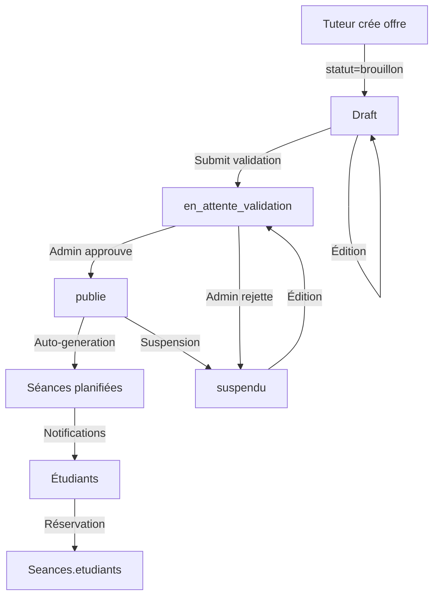

# ANALYSE COMPLÈTE : PLATEFORME DE TUTORAT DJANGO/REACT NATIVE

**Date de l'analyse:** 1er juin 2026
**Architecture:** Django REST Framework (Backend) + React Native (Frontend)
**Type de projet:** Application de plateforme de tutorat en ligne et présentiel

---

## 📋 TABLE DES MATIÈRES

1. [Acteurs et Rôles du Système](#acteurs-et-rôles-du-système)
2. [Modèles de Données Clés](#modèles-de-données-clés)
3. [Endpoints API Principaux](#endpoints-api-principaux)
4. [Flux d'Activités Principaux](#flux-dactivités-principaux)
5. [Architecture Générale](#architecture-générale)
6. [Relations entre Entités](#relations-entre-entités)
7. [Diagrammes et Workflows](#diagrammes-et-workflows)

---

## 1. ACTEURS ET RÔLES DU SYSTÈME

### 1.1 Rôles Utilisateurs

Le système implémente **4 rôles principaux** avec des permissions et fonctionnalités distinctes :

#### **A. ÉTUDIANT** (`etudiant`)
**Définition:** Utilisateur cherchant de l'aide académique

**Permissions et Fonctionnalités:**
- ✅ Inscription et création de compte
- ✅ Recherche de tuteurs et offres de tutorat
- ✅ Réservation de séances individuelles
- ✅ Inscription à des groupes de tutorat
- ✅ Participation aux séances
- ✅ Évaluation des tuteurs après séances
- ✅ Création de questions sur le forum
- ✅ Réponse aux questions (pour aider)
- ✅ Vote sur les réponses du forum
- ✅ Consultation des ressources publiées
- ✅ Partage de ressources avec d'autres étudiants
- ✅ Messagerie 1-à-1 avec tuteurs/autres
- ✅ Gamification : badges, points, objectifs d'apprentissage

**Restrictions:**
- ❌ Impossibilité de créer/publier des offres de tutorat
- ❌ Impossibilité de valider les ressources
- ❌ Impossibilité d'accéder au tableau de bord admin

---

#### **B. TUTEUR** (`tuteur`)
**Définition:** Utilisateur offrant des services de tutorat

**Permissions et Fonctionnalités:**
- ✅ Inscription et création de profil
- ✅ Création et gestion d'offres de tutorat
- ✅ Configuration des disponibilités
- ✅ Génération automatique de planning
- ✅ Gestion des séances de tutorat
- ✅ Écriture de rapports de séance
- ✅ Évaluation des étudiants
- ✅ Création de ressources pédagogiques
- ✅ Gestion des groupes de tutorat
- ✅ Réponse aux questions du forum (comme expert)
- ✅ Envoi de messages vocaux sur les réponses
- ✅ Messagerie avec les étudiants
- ✅ Suivi de performance (note moyenne, taux complétude)
- ✅ Accès au profil avec statistiques

**Restrictions:**
- ❌ Impossibilité d'accéder au tableau de bord admin
- ❌ Impossibilité de valider/rejeter les ressources d'autres
- ❌ Limitation à ses propres offres

**Données Spécifiques:**
- Profil étendu : `TutorProfile`
- Matieres enseignées, niveau d'expérience
- Note moyenne calculée dynamiquement
- Nombre total de sessions réalisées

---

#### **C. ENSEIGNANT** (`enseignant`)
**Définition:** Variante du tuteur (rôle dérivé)

**Spécificités:**
- Peut être traité comme tuteur dans le système
- Permissions quasi identiques aux tuteurs
- Possibilité de se connecter via rôle "tuteur"
- Peut créer des groupes de tutorat pour leurs classes

---

#### **D. ADMINISTRATEUR** (`admin`)
**Définition:** Gestionnaire de la plateforme

**Permissions et Fonctionnalités:**
- ✅ Accès complet à tous les modèles
- ✅ Voir tous les utilisateurs, offres, séances
- ✅ Validation/rejet des ressources pédagogiques
- ✅ Activation/désactivation des comptes utilisateurs
- ✅ Suspension d'utilisateurs avec raison
- ✅ Modération du forum (suppression, restauration)
- ✅ Gestion de la configuration système
- ✅ Génération de rapports détaillés
- ✅ Export des données (PDF, Word)
- ✅ Tableau de bord statistique complet
- ✅ Gestion des demandes de tuteur (acceptation/rejet)

**Fonctionnalités Admin Spécifiques:**
- Validation des offres avant publication
- Modération du forum (questions, réponses)
- Suspension d'utilisateurs pour violation
- Gestion des paramètres système
- Rapports : utilisateurs, tutorat, ressources, forum
- Statistiques d'activité globale

---

### 1.2 Flux de Transition de Rôle

```
INSCRIPTION
    ↓
Utilisateur créé avec rôle par défaut: "étudiant" (is_active=False)
    ↓
VALIDATION ADMIN
    ↓
✓ Compte activé (is_active=True)
    ↓
UTILISATION NORMALE
    ↓
DEMANDE DE DEVENIR TUTEUR (optionnel)
    ↓
VALIDATION ADMIN
    ↓
✓ Rôle changé à "tuteur" + TutorProfile créé
```

---

## 2. MODÈLES DE DONNÉES CLÉS

### 2.1 Application: `apps.accounts` - Gestion des Utilisateurs

#### **Modèle: User** (Customisé via AbstractBaseUser)
```
┌─ User (Authentification)
├─ Email (unique, identifiant principal)
├─ Mot de passe (hashé)
├─ Rôle (etudiant|tuteur|enseignant|admin)
├─ Profil De Base
│  ├─ Nom, Prénom
│  ├─ Photo (Cloudinary)
│  ├─ Bio/Biographie
│  ├─ Téléphone
│  └─ Date de naissance
├─ Données Académiques
│  ├─ Filière
│  ├─ Année
│  ├─ Niveau d'études
│  └─ Établissement
├─ Données Spécifiques Tuteur
│  ├─ Matieres maitrisees (JSON)
│  ├─ Tarif horaire
│  ├─ Justificatif (document)
│  ├─ Note moyenne (calculée)
│  ├─ Nombre d'évaluations
│  └─ Centres d'intérêt
├─ Badges et Certifications
│  ├─ Badges (JSON)
│  ├─ Certifié (boolean)
│  └─ Date de certification
├─ États
│  ├─ est_actif (logique applicative)
│  ├─ is_active (JWT)
│  ├─ is_staff (admin Django)
│  ├─ is_suspended (suspendu)
│  ├─ suspension_until (date)
│  └─ suspension_reason (texte)
└─ Métadonnées
   ├─ date_inscription
   ├─ date_derniere_connexion
   └─ email_verifie
```

**Cardinalité avec autres modèles:**
- 1 User ↔ 1 TutorProfile (si tuteur)
- 1 User → N OffreTutorat (si tuteur, créateur)
- 1 User → N Seance (comme tuteur)
- 1 User → N Seance (comme étudiant, via M2M)
- 1 User → N Question (forum)
- 1 User → N Reponse (forum)
- 1 User → N Message (messagerie)

---

#### **Modèle: TutorProfile** (Données Étendues Tuteur)
```
┌─ TutorProfile (OneToOne avec User si role=tuteur)
├─ Qualifications
│  ├─ Diplômes (JSON: [])
│  ├─ Compétences (JSON: [])
│  ├─ Langues (JSON: [])
│  ├─ Méthodes enseignement (texte)
│  └─ Zone géographique
├─ Modalités
│  ├─ Accepte en ligne (boolean)
│  ├─ Accepte présentiel (boolean)
│  ├─ Tarif réduit (boolean)
│  └─ Conditions réductions (texte)
├─ Statistiques Calculées
│  ├─ Total séances
│  ├─ Total étudiants uniques
│  ├─ Taux réponse (%)
│  ├─ Taux complétude (%)
│  ├─ Temps moyen réponse (durée)
│  └─ Performance par matière (JSON)
├─ Gamification
│  ├─ Points
│  ├─ Badge solutions
│  ├─ Badge aide
│  └─ Badge expert
└─ Métadonnées
   ├─ created_at
   └─ updated_at
```

---

#### **Modèle: DemandeTuteur**
```
┌─ DemandeTuteur
├─ Utilisateur FK → User
├─ Statut (en_attente|valide|rejete)
├─ Date soumission (auto_now_add)
└─ Commentaire admin (texte)
```

**Flux:**
1. Étudiant soumet demande de devenir tuteur
2. Admin examine → validate/reject
3. Si valide → User.role = "tuteur" + TutorProfile créé
4. Si rejeté → Email + feedback admin

---

#### **Modèle: SystemSettings**
```
┌─ SystemSettings (Singleton)
├─ Notifications
│  ├─ Email notifications activées
│  └─ Push notifications
├─ Configuration
│  ├─ Mode maintenance
│  ├─ Autoriser inscriptions
│  ├─ Vérification email requise
│  ├─ Taille max fichier (MB)
│  └─ Max inscriptions/jour
└─ Métadonnées
   ├─ created_at
   ├─ updated_at
   └─ updated_by FK → User (admin)
```

---

### 2.2 Application: `apps.tutorat` - Gestion du Tutorat

#### **Modèle: OffreTutorat** (Annonce de séances)
```
┌─ OffreTutorat
├─ Tuteur FK → User (tuteur/enseignant)
├─ Informations Basiques
│  ├─ Titre
│  ├─ Description
│  ├─ Matière (libre, indexée)
│  ├─ Niveau (L1|L2|L3|M1|M2)
│  └─ Type (individuel|groupe)
├─ Tarification
│  ├─ Tarif (décimal)
│  ├─ Tarif réduit (optionnel)
│  └─ Gratuit (boolean)
├─ Planning & Disponibilités
│  ├─ Durée session (minutes)
│  ├─ Nombre places
│  ├─ Planning flexible (boolean)
│  ├─ Mode planning (manuel|auto_dispos|repetitif)
│  └─ Repetition config (JSON)
├─ Modalités
│  ├─ En ligne (boolean)
│  ├─ Présentiel (boolean)
│  ├─ Lieu (adresse si présentiel)
│  └─ Lien visio (URL si ligne)
├─ Workflow & Validation
│  ├─ Statut workflow (brouillon|en_attente_validation|publie|suspendu|archive)
│  ├─ Est active (boolean)
│  ├─ Validée par admin (boolean)
│  ├─ Date validation
│  ├─ Admin validateur FK
│  └─ Dates exclues (JSON: [])
├─ Statistiques
│  ├─ Vues (compteur)
│  ├─ Candidatures (compteur)
│  ├─ Sessions réalisées (compteur)
│  └─ Note moyenne (float)
└─ Métadonnées
   ├─ date_creation (auto_now_add)
   ├─ date_modification (auto_now)
   └─ date_publication
```

**Méthodes importantes:**
- `generer_planning_sessions()` - Crée automatiquement sessions récurrentes
- `verifier_disponibilite()` - Validation contre disponibilités tuteur
- `nombre_inscrits` (property) - Compte places occupées
- `places_disponibles` (property) - Places restantes

---

#### **Modèle: Disponibilite** (Planning du Tuteur)
```
┌─ Disponibilite
├─ Tuteur FK → User
├─ Planification
│  ├─ Jour semaine (0-6: Lundi-Dimanche)
│  ├─ Heure début (TimeField)
│  ├─ Heure fin (TimeField)
│  └─ Est récurrent (boolean)
├─ Exceptions
│  ├─ Date exception (optionnel, si non récurrent)
│  └─ Indisponible (boolean, pour marquer exception)
└─ Métadonnées
   └─ created_at (auto_now_add)
```

**Usage:** Verifier avant de générer séances automatiques

---

#### **Modèle: Seance** (Session de tutorat réelle)
```
┌─ Seance
├─ Lien à l'offre
│  ├─ Offre FK (optionnel)
│  └─ Groupe FK (optionnel)
├─ Participants
│  ├─ Tuteur FK → User
│  └─ Étudiants M2M → User
├─ Planning & Durée
│  ├─ Date-heure début (DateTimeField, indexed)
│  ├─ Date-heure fin (DateTimeField)
│  ├─ Durée (minutes, informatif)
│  ├─ Statut (planifiee|confirmee|en_cours|terminee|annulee|manquee)
│  ├─ Commentaire annulation
│  └─ Date annulation (optionnel)
├─ Modalités
│  ├─ En ligne (boolean)
│  ├─ Lien visio (URL)
│  ├─ Lieu (adresse)
├─ Contenu Pédagogique
│  ├─ Sujet (titre)
│  ├─ Description
│  └─ Ressources partagées (JSON: [])
├─ Rapports Post-Séance
│  ├─ Rapport tuteur (texte)
│  ├─ Rapport étudiant (texte)
│  ├─ Travail réalisé (texte)
│  └─ Objectifs suivants (texte)
└─ Métadonnées
   ├─ date_creation (auto_now_add)
   └─ date_modification (auto_now)
```

**Properties:**
- `est_terminee` - boolean
- `nombre_etudiants` - count

---

#### **Modèle: Evaluation** (Notation post-séance)
```
┌─ Evaluation (unique_together: seance, auteur, cible)
├─ Seance FK → Seance
├─ Auteur FK → User (qui évalue)
├─ Cible FK → User (qui est évalué)
├─ Notation
│  ├─ Note globale (1-5)
│  └─ Commentaire (optionnel)
├─ Critères Détaillés
│  ├─ Clarté explication (1-5)
│  ├─ Patience (1-5)
│  ├─ Préparation (1-5)
│  └─ Efficacité (1-5)
└─ Métadonnées
   └─ date (auto_now_add)
```

**Usage:** Calculer la note moyenne du tuteur pour son profil

---

#### **Modèle: GroupeTutorat** (Groupe de séances répétées)
```
┌─ GroupeTutorat
├─ Lien
│  ├─ Offre FK (optionnel)
│  └─ Créateur FK → User
├─ Informations
│  ├─ Nom
│  ├─ Description
│  ├─ Capacité max
│  ├─ Nombre membres (compteur)
│  └─ Nombre sessions (compteur)
├─ Dates
│  ├─ Date début (optionnel)
│  └─ Date fin (optionnel)
├─ Paramètres
│  ├─ Privé (boolean)
│  ├─ Code accès (si privé)
│  ├─ Auto inscription (boolean)
└─ Métadonnées
   └─ date_creation
```

---

#### **Modèle: InscriptionOffre** (Réservation de séance individuelle)
```
┌─ InscriptionOffre
├─ Étudiant FK → User
├─ Offre FK → OffreTutorat
├─ Statut (en_attente|acceptee|refusee)
├─ Date inscription (auto_now_add)
└─ (Relation M2M avec séances)
```

---

#### **Modèle: InscriptionGroupe** (Adhésion groupe)
```
┌─ InscriptionGroupe (unique_together: etudiant, groupe)
├─ Étudiant FK → User
├─ Groupe FK → GroupeTutorat
├─ Statut (en_attente|accepte|refuse)
└─ Date inscription (auto_now_add)
```

---

### 2.3 Application: `apps.forum` - Forum de Questions/Réponses

#### **Modèle: Question** (Post initial)
```
┌─ Question
├─ Contenu
│  ├─ Titre (max 255)
│  ├─ Contenu (TextField)
│  ├─ Auteur FK → User
│  ├─ Matière (indexed)
│  ├─ Tags (texte séparé virgules)
│  └─ Priorité (haute|moyenne|basse)
├─ État
│  ├─ Est résolue (boolean)
│  ├─ Deleted (boolean, soft delete)
│  ├─ Nb vues (compteur)
│  └─ Date dernière réponse (optionnel)
└─ Métadonnées
   └─ date_publication (auto_now_add, indexed)
```

**Workflow:**
1. Étudiant/Tuteur crée question
2. Tuteurs répondent avec solutions
3. Auteur peut accepter réponse comme "solution"
4. Forum avertit les abonnés

---

#### **Modèle: Reponse** (Réponse à question)
```
┌─ Reponse
├─ Question FK → Question
├─ Auteur FK → User
├─ Contenu (TextField)
├─ État
│  ├─ Est solution (boolean, marquée par auteur question)
│  ├─ Deleted (boolean, soft delete)
│  ├─ Nb votes (int, somme des votes)
│  └─ Date (auto_now_add)
└─ Relation
    └─ Votes M2M (via VoteReponse)
```

---

#### **Modèle: VoteReponse** (Système de vote)
```
┌─ VoteReponse (unique_together: reponse, votant)
├─ Réponse FK → Reponse
├─ Votant FK → User
├─ Valeur (+1 ou -1)
└─ Date (auto_now_add)
```

---

#### **Modèle: MessageVocal** (Messages vocaux réponses)
```
┌─ MessageVocal
├─ Réponse FK → Reponse (optionnel)
├─ Auteur FK → User
├─ Audio File (Cloudinary)
├─ Durée (DurationField)
└─ Date envoi (auto_now_add)
```

**Feature:** Tuteurs peuvent envoyer réponses audio pour clarifier

---

#### **Modèle: AbonnementQuestion** (Suivi de questions)
```
┌─ AbonnementQuestion (unique_together: question, utilisateur)
├─ Question FK → Question
├─ Utilisateur FK → User
└─ Date abonnement (auto_now_add)
```

---

#### **Modèles Modération:**

**ModerationLog:**
```
┌─ ModerationLog
├─ Modérateur FK → User (admin)
├─ Action (delete|restore|suspend|unsuspend|other)
├─ Type contenu (question|reponse|user)
├─ ID contenu (int)
├─ Raison (texte)
└─ Created at (auto_now_add)
```

**NotificationForum:**
```
┌─ NotificationForum
├─ Destinataire FK → User
├─ Type (nouvelle_reponse|solution|vocal|mention|abonnement)
├─ Question FK → Question
├─ Message (texte)
├─ Lue (boolean)
└─ Date création (auto_now_add)
```

---

### 2.4 Application: `apps.messagerie` - Messaging & Email

#### **Modèle: Conversation** (Contexte de discussion)
```
┌─ Conversation
├─ Type (individuelle|groupe_etudiants|groupe_tuteurs|support_admin|tutorat_groupe)
├─ Statut (active|archivee|suspendue)
├─ Infos
│  ├─ Titre (optionnel)
│  ├─ Description
│  ├─ Avatar (image)
│  ├─ Tags
│  └─ Participants M2M (via ParticipantsConversation)
├─ Configuration
│  ├─ Autoriser fichiers
│  ├─ Taille max fichier (bytes)
│  └─ Nb max participants
└─ Métadonnées
   ├─ date_creation
   ├─ dernier_message (DateTime, nullable)
   └─ date_archivage (optionnel)
```

---

#### **Modèle: ParticipantsConversation** (Adhésion + rôles)
```
┌─ ParticipantsConversation (unique_together: conversation, utilisateur)
├─ Conversation FK → Conversation
├─ Utilisateur FK → User
├─ Rôle (admin|moderateur|participant|observateur)
├─ État du Participant
│  ├─ A rejoint (DateTimeField)
│  ├─ A quitté (optionnel)
│  └─ Est actif (boolean)
├─ Permissions Granulaires
│  ├─ Peut écrire (boolean)
│  ├─ Peut partager fichiers (boolean)
│  └─ Peut inviter (boolean)
└─ Notifications
    ├─ Notifications activées (boolean)
    ├─ Dernier message lu (optionnel)
    └─ Nb messages non lus (compteur)
```

---

#### **Modèle: Message** (Contenu de discussion)
```
┌─ Message
├─ Conversation FK → Conversation
├─ Expéditeur FK → User
├─ Contenu
│  ├─ Type (texte|image|document|audio|video|lien_ressource|invitation_seance|systeme)
│  ├─ Contenu (TextField)
│  ├─ Fichier (optionnel, FileField)
│  ├─ Nom original fichier
│  ├─ Type fichier (mime type)
│  └─ Taille fichier (bytes)
├─ Métadonnées
│  ├─ Date envoi (auto_now_add)
│  ├─ Date modification (optionnel)
│  ├─ Date suppression (optionnel)
│  └─ Est supprimé (boolean, soft delete)
├─ État
│  ├─ Lu (boolean)
│  ├─ Est édité (boolean)
├─ Réponses & Forwards
│  ├─ Message parent FK (self, pour réponses)
│  ├─ Est forward (boolean)
│  ├─ Message original FK (optionnel)
│  └─ Nb réactions (compteur)
└─ Relation
    └─ Réactions M2M (via ReactionMessage)
```

---

#### **Modèle: ReactionMessage** (Emoji reactions)
```
┌─ ReactionMessage (unique_together: message, utilisateur, type_reaction)
├─ Message FK → Message
├─ Utilisateur FK → User
├─ Type (like|love|laugh|wow|sad|angry|custom)
├─ Emoji custom (texte, si custom)
└─ Date réaction (auto_now_add)
```

---

#### **Modèle: PieceJointeMessage** (Attachments)
```
┌─ PieceJointeMessage
├─ Message FK → Message
├─ Fichier (FileField)
├─ Nom original
├─ Type fichier (mime type)
├─ Taille (bytes)
├─ Vignette (optionnel, pour images)
├─ Date upload (auto_now_add)
└─ Sécurité
   ├─ Est virus scanné
   └─ Est chiffré
```

---

#### **Modèles Email:**

**EmailMessage:**
```
┌─ EmailMessage
├─ Expéditeur FK → User
├─ Destinataire FK → User
├─ Sujet (max 200)
├─ Contenu (TextField)
├─ Statut (brouillon|envoye|echec|recu|lu|repondu)
├─ Dates
│  ├─ date_envoi
│  ├─ date_reception (optionnel)
│  └─ date_lecture (optionnel)
└─ Traçabilité
   └─ email_id_externe (identifiant SMTP)
```

**EmailReponse:**
```
┌─ EmailReponse
├─ Email original FK → EmailMessage
├─ Auteur FK → User
├─ Contenu (TextField)
└─ Date envoi (auto_now_add)
```

**AccuseReception:**
```
┌─ AccuseReception
├─ Email FK → EmailMessage
├─ Type (envoi|reception|lecture)
├─ Date accus (auto_now_add)
├─ IP adresse (GenericIPAddressField)
└─ User agent (texte)
```

---

### 2.5 Application: `apps.ressources` - Gestion des Ressources Pédagogiques

#### **Modèle: Ressource** (Ressource globale publiée)
```
┌─ Ressource
├─ Métadonnées
│  ├─ Titre (max 255)
│  ├─ Description (TextField)
│  ├─ Auteur FK → User
│  ├─ Matière (indexed)
│  ├─ Niveau (indexed)
│  └─ Tags (texte séparé virgules)
├─ Contenu
│  ├─ Type (cours|pdf|exercice|corrige|video|lien|image)
│  ├─ Fichier (CloudinaryField, auto)
│  └─ Lien externe (URLField)
├─ État & Validation
│  ├─ Statut (en_attente|publie|rejete)
│  └─ Commentaire rejet (optionnel)
├─ Statistiques
│  ├─ Nb téléchargements (compteur)
│  └─ Nb vues (compteur)
└─ Métadonnées
   ├─ date_publication (auto_now_add, indexed)
   └─ date_maj (auto_now)
```

---

#### **Modèle: VersionRessource** (Historique versions)
```
┌─ VersionRessource
├─ Ressource FK → Ressource
├─ Fichier (CloudinaryField)
├─ Commentaire (texte)
└─ Date upload (auto_now_add)
```

---

#### **Modèle: CommentaireRessource** (Retours)
```
┌─ CommentaireRessource
├─ Ressource FK → Ressource
├─ Auteur FK → User
├─ Contenu (TextField)
├─ Date (auto_now_add)
└─ Signalé (boolean)
```

---

#### **Modèle: NoteRessource** (Système de rating)
```
┌─ NoteRessource (unique_together: ressource, auteur)
├─ Ressource FK → Ressource
├─ Auteur FK → User
├─ Note (1-5)
└─ Date (auto_now_add)
```

---

#### **Modèle: FavoriRessource** (Favoris utilisateur)
```
┌─ FavoriRessource (unique_together: utilisateur, ressource)
├─ Utilisateur FK → User
├─ Ressource FK → Ressource
└─ Date (auto_now_add)
```

---

#### **Modèle: PartageRessource** (Partage entre étudiants)
```
┌─ PartageRessource (unique_together: ressource, destinataire)
├─ Ressource FK → Ressource
├─ Expéditeur FK → User
├─ Destinataire FK → User
├─ Contenu
│  ├─ Date partage (auto_now_add)
│  └─ Commentaire personnel (optionnel)
├─ État
│  ├─ Statut validation (en_attente|validee|rejetee)
│  ├─ Est lue (boolean)
│  └─ Date lecture (optionnel)
└─ Métadonnées
   └─ ordered by: -date_partage
```

---

#### **Modèle: Signalement** (Reports de contenu)
```
┌─ Signalement
├─ Type contenu (ressource|commentaire)
├─ ID contenu (int, vers ressource ou commentaire)
├─ Motif (TextField)
├─ Signalant FK → User
├─ Date (auto_now_add)
└─ Traité (boolean)
```

---

## 3. ENDPOINTS API PRINCIPAUX

### 3.1 Authentification (`/accounts/`)

| Endpoint | Méthode | Auth | Retour | Description |
|----------|---------|------|--------|-------------|
| `/login/` | POST | ❌ | JWT tokens + User | Connexion avec email/password |
| `/register/` | POST | ❌ | User created | Inscription nouvel utilisateur |
| `/change-password/` | POST | ✅ | Status | Changer mot de passe |
| `/token/refresh/` | POST | ✅ | New access token | Renouveler access token |
| `/token/verify/` | POST | ✅ | Token valid | Vérifier token valide |
| `/profile/` | GET/PUT | ✅ | User data | Profil connecté + modifications |
| `/demande-tuteur/` | POST | ✅ | Demande | Demande devenir tuteur |
| `/stats/` | GET | ❌ | Stats globales | Stats publiques plateforme |
| `/admin/stats/` | GET | ✅ (admin) | Détails stats | Dashboard admin complet |

**Payload Login:**
```json
{
  "email": "utilisateur@email.com",
  "password": "mot_de_passe",
  "role": "etudiant" // optionnel, pour multi-rôle
}
```

**Réponse Login (succès):**
```json
{
  "message": "Connexion réussie",
  "access": "eyJ0eXAiOiJKV1Q...",
  "refresh": "eyJ0eXAiOiJKV1Q...",
  "user": {
    "id": 1,
    "email": "user@email.com",
    "prenom": "Jean",
    "nom": "Dupont",
    "role": "etudiant",
    "is_active": true
  }
}
```

---

### 3.2 Gestion des Offres de Tutorat (`/tutorat/offres/`)

| Endpoint | Méthode | Permissions | Description |
|----------|---------|-------------|-------------|
| `/offres/` | GET | ✅ | Lister offres (filtrées par rôle) |
| `/offres/` | POST | Tuteur | Créer nouvelle offre |
| `/offres/{id}/` | GET | ✅ | Détail offre |
| `/offres/{id}/` | PUT/PATCH | Admin/Propriétaire | Modifier offre |
| `/offres/{id}/` | DELETE | Admin/Propriétaire | Supprimer offre |
| `/offres/{id}/valider_offre/` | POST | Admin | Valider offre (publication) |
| `/offres/{id}/suspendre_offre/` | POST | Admin | Suspendre offre |
| `/offres/{id}/generer_planning/` | POST | Tuteur | Générer séances récurrentes |
| `/offres/{id}/verifier_disponibilites/` | GET | Tuteur | Vérifier conflits planning |
| `/offres/{id}/dupliquer_offre/` | POST | Tuteur | Copier offre avec mods |

**Filtres GET disponibles:**
- `matiere`, `niveau`, `type`, `est_active`, `tuteur`, `statut_workflow`, `mode_planning`

---

### 3.3 Gestion des Séances (`/tutorat/seances/`)

| Endpoint | Méthode | Description |
|----------|---------|-------------|
| `/seances/` | GET | Lister séances (filtrées) |
| `/seances/` | POST | Créer séance |
| `/seances/{id}/` | GET | Détail séance |
| `/seances/{id}/` | PUT/PATCH | Modifier séance |
| `/seances/disponibles-etudiants/` | GET | Séances réservables |
| `/seances/etudiant/` | GET | Mes séances (utilisateur) |
| `/seances/avenir/` | GET | Séances futures |
| `/seances/mettre-a-jour-expirees/` | POST | Marquer passées comme "terminées" |
| `/seances/inscrire/` | POST | Inscrire étudiant à séance |
| `/seances/{id}/annuler/` | POST | Annuler séance |
| `/seances/{id}/confirmer/` | POST | Confirmer participation |
| `/seances/creer-direct/` | POST | Créer séance "à la demande" |
| `/seances/inscrire-seance-existante/` | POST | Inscrire à séance existante |

---

### 3.4 Recherche de Tuteurs (`/tutorat/tuteurs/`)

| Endpoint | Méthode | Description |
|----------|---------|-------------|
| `/tuteurs/recherche/` | GET | Rechercher tuteurs (filtres) |
| `/tuteurs/recommandes/` | GET | Tuteurs recommandés |
| `/tuteurs/classement/` | GET | Top tuteurs (note/avis) |
| `/tuteurs/disponibles-maintenant/` | GET | Tuteurs dispo "tout de suite" |
| `/tuteurs/{id}/profile/` | GET | Profil complet tuteur |
| `/tuteurs/{id}/evaluations/` | GET | Avis tuteur |
| `/tuteurs/{id}/disponibilites/` | GET | Planning tuteur |
| `/tuteurs/{id}/seances/` | GET | Séances réalisées tuteur |

---

### 3.5 Forum (`/forum/`)

| Endpoint | Méthode | Permissions | Description |
|----------|---------|-------------|-------------|
| `/questions/` | GET | ✅ | Lister questions |
| `/questions/` | POST | ✅ | Créer question |
| `/questions/{id}/` | GET | ✅ | Détail question |
| `/questions/{id}/` | PUT | Auteur/Admin | Modifier question |
| `/questions/{id}/delete/` | DELETE | Auteur/Admin | Supprimer question |
| `/questions/{id}/vue/` | POST | ✅ | Incrémenter vues |
| `/questions/{id}/abonner/` | POST | ✅ | S'abonner notifications |
| `/questions/{id}/desabonner/` | POST | ✅ | Se désabonner |
| `/questions/recentes/` | GET | ✅ | Questions récentes |
| `/questions/suivies/` | GET | ✅ | Mes questions suivies |
| `/reponses/` | GET | ✅ | Lister réponses |
| `/reponses/` | POST | ✅ | Répondre à question |
| `/reponses/{id}/` | GET | ✅ | Détail réponse |
| `/reponses/{id}/accepter-solution/` | POST | Auteur question | Accepter comme solution |
| `/votes/` | GET | ✅ | Lister votes |
| `/votes/` | POST | ✅ | Voter (+1 ou -1) |
| `/messages-vocaux/` | GET/POST | ✅ | Messages audio réponses |
| `/statistiques/etudiant/` | GET | ✅ | Stats forum user |
| `/admin/moderation/questions/` | GET | Admin | Modération questions |
| `/admin/moderation/reponses/` | GET | Admin | Modération réponses |
| `/admin/moderation/users/{id}/suspend/` | POST | Admin | Suspendre utilisateur |

---

### 3.6 Messagerie (`/messagerie/`)

| Endpoint | Méthode | Description |
|----------|---------|-------------|
| `/conversations/` | GET | Mes conversations |
| `/conversations/` | POST | Créer conversation |
| `/conversations/{id}/` | GET | Détail conversation |
| `/conversations/{id}/start/` | POST | Démarrer avec utilisateur |
| `/conversations/{id}/envoyer/` | POST | Envoyer message texte |
| `/conversations/{id}/envoyer_vocal/` | POST | Envoyer message audio |
| `/conversations/{id}/marquer_lu/` | POST | Marquer lus tous messages |
| `/messages/` | GET | Lister messages (paginé) |
| `/messages/{id}/` | GET | Détail message |
| `/messages/{id}/` | PUT | Éditer message |
| `/messages/{id}/` | DELETE | Supprimer message |
| `/email-messages/` | GET | Emails reçus |
| `/email-messages/` | POST | Envoyer email |

---

### 3.7 Ressources (`/ressources/`)

| Endpoint | Méthode | Permissions | Description |
|----------|---------|-------------|-------------|
| `/ressources/` | GET | ✅ | Lister ressources (publiées) |
| `/ressources/` | POST | ✅ | Créer ressource (en attente) |
| `/ressources/{id}/` | GET | ✅ | Détail ressource |
| `/ressources/{id}/` | PUT | Auteur/Admin | Modifier ressource |
| `/ressources/{id}/comment/` | POST | ✅ | Ajouter commentaire |
| `/ressources/{id}/noter/` | POST | ✅ | Noter ressource (1-5) |
| `/ressources/{id}/favori/` | POST | ✅ | Ajouter/retirer favoris |
| `/ressources/{id}/vue/` | POST | ✅ | Enregistrer consultation |
| `/ressources/{id}/telecharger/` | POST | ✅ | Enregistrer téléchargement |
| `/admin/ressources/en-attente/` | GET | Admin | Ressources en validation |
| `/admin/ressources/{id}/valider/` | POST | Admin | Approuver ressource |
| `/admin/ressources/{id}/rejeter/` | POST | Admin | Rejeter ressource |
| `/partager/` | POST | ✅ | Partager ressource |
| `/partages/recus/` | GET | ✅ | Ressources reçues |
| `/partages/envoyes/` | GET | ✅ | Ressources envoyées |
| `/partages/{id}/marquer-lu/` | POST | ✅ | Marquer comme lue |

---

## 4. FLUX D'ACTIVITÉS PRINCIPAUX

### 4.1 Flux: Authentification & Inscription

```
┌─────────────────────────────────────────────────────────┐
│ NOUVEAU UTILISATEUR                                     │
└─────────────────────────────────────────────────────────┘
                          ↓
         Frontend: /register
    (email, password, prenom, nom, role)
                          ↓
         POST /accounts/register/
                          ↓
    ✓ Validation champs requis
    ✓ Validation unicité email
    ✓ Validation force mdp (6+ chars)
    ✓ Matching mdp / confirm_mdp
                          ↓
    ✓ Créer User(email, role='etudiant', is_active=False)
                          ↓
    ✓ Retourner user data + message "en attente d'activation"
                          ↓
         [EMAIL OPTIONNEL AU NOUVEL UTILISATEUR]
                          ↓
┌─────────────────────────────────────────────────────────┐
│ ADMIN REVOIT INSCRIPTION                                │
└─────────────────────────────────────────────────────────┘
                          ↓
    GET /accounts/users/  (admin list)
                          ↓
    PUT /accounts/users/{id}/  (set is_active=True)
                          ↓
         [EMAIL À L'UTILISATEUR: COMPTE ACTIVÉ]
                          ↓
┌─────────────────────────────────────────────────────────┐
│ UTILISATEUR CONNECTÉ                                     │
└─────────────────────────────────────────────────────────┘
                          ↓
         Frontend: /login
    (email, password)
                          ↓
    POST /accounts/login/
                          ↓
    ✓ Authenticate(email, password)
    ✓ Vérifier is_active=True
    ✓ Vérifier rôle si multi-sélection
                          ↓
    ✓ Générer RefreshToken + AccessToken (JWT)
    ✓ Retourner tokens + user profile
                          ↓
    Frontend: Stocker tokens en localStorage/secureStorage
    Utiliser Authorization: Bearer {access_token}
```

---

### 4.2 Flux: Demande Devenir Tuteur

```
┌─────────────────────────────────────────────────────────┐
│ ÉTUDIANT CONNECTÉ VEUT DEVENIR TUTEUR                   │
└─────────────────────────────────────────────────────────┘
                          ↓
    Frontend: /demande-tuteur (form)
    - Matieres enseignables
    - Expérience
    - Méthode enseignement
    - etc.
                          ↓
    POST /accounts/demande-tuteur/
                          ↓
    ✓ Créer DemandeTuteur(utilisateur, statut='en_attente')
                          ↓
    ✓ Notifier admins (notification)
                          ↓
         [EMAIL À ADMIN: NOUVELLE DEMANDE TUTEUR]
                          ↓
┌─────────────────────────────────────────────────────────┐
│ ADMIN REVOIT DEMANDE                                    │
└─────────────────────────────────────────────────────────┘
                          ↓
    GET /accounts/rapports/utilisateurs/
    (filtre: demandes_tuteur non traitées)
                          ↓
    [Admin examine documents/profil]
                          ↓
    APPROUVER:
    └─ PUT /accounts/demandes/{id}/ (statut='valide')
       ✓ User.role = 'tuteur'
       ✓ TutorProfile.create(user)
       ✓ Email: "Bienvenue tuteur!"
                          ↓
    OU REJETER:
    └─ PUT /accounts/demandes/{id}/ (statut='rejete', motif)
       ✓ Email: "Demande refusée: {motif}"
```

---

### 4.3 Flux: Création & Publication d'Offre de Tutorat

```
┌─────────────────────────────────────────────────────────┐
│ TUTEUR CRÉE OFFRE                                        │
└─────────────────────────────────────────────────────────┘
                          ↓
    Frontend: /tutorat/create-offer
    - Titre, Description
    - Matière, Niveau
    - Type (individuel|groupe)
    - Tarif (optionnel)
    - Modalité (en_ligne|présentiel)
    - Mode planning (manuel|auto_dispos|repetitif)
    - Si repetitif: config jours/heures
                          ↓
    POST /tutorat/offres/
    {
      "titre": "Génie Informatique Niveau L2",
      "matiere": "genie_informatique",
      "niveau": "L2",
      "type": "groupe",
      "tarif": 10.00,
      "en_ligne": true,
      "mode_planning": "repetitif",
      "repetition_config": {
        "jours": [1, 3, 5],  // Mar, Jeu, Sam
        "heure_debut": "14:00"
      }
    }
                          ↓
    ✓ Créer OffreTutorat(tuteur=user, statut_workflow='brouillon')
    ✓ Retourner offre + message "en brouillon"
                          ↓
┌─────────────────────────────────────────────────────────┐
│ TUTEUR PUBLIE OFFRE (optionnel)                          │
└─────────────────────────────────────────────────────────┘
                          ↓
    PUT /tutorat/offres/{id}/ 
    {
      "statut_workflow": "en_attente_validation"
    }
                          ↓
    ✓ OffreTutorat.statut_workflow = 'en_attente_validation'
    ✓ Notifier admin
                          ↓
┌─────────────────────────────────────────────────────────┐
│ ADMIN VALIDE OFFRE                                       │
└─────────────────────────────────────────────────────────┘
                          ↓
    GET /tutorat/offres/?statut_workflow=en_attente_validation
    (Admin voit offres à valider)
                          ↓
    [Admin examine offre]
                          ↓
    APPROUVER:
    └─ POST /tutorat/offres/{id}/valider_offre/
       ✓ OffreTutorat.statut_workflow = 'publie'
       ✓ OffreTutorat.validee_par_admin = True
       ✓ OffreTutorat.date_validation = now()
       ✓ Email Tuteur: "Offre approuvée et publiée!"
       ✓ Notification aux étudiants: "Nouvelle offre!"
                          ↓
    OU REJETER:
    └─ POST /tutorat/offres/{id}/suspendre_offre/
       ✓ OffreTutorat.statut_workflow = 'suspendu'
       ✓ Email Tuteur: "Offre suspendue"
                          ↓
┌─────────────────────────────────────────────────────────┐
│ TUTEUR GÉNÈRE PLANNING (si repetitif)                    │
└─────────────────────────────────────────────────────────┘
                          ↓
    POST /tutorat/offres/{id}/generer_planning/
    {
      "date_debut": "2026-06-15",
      "date_fin": "2026-07-30"
    }
                          ↓
    ✓ Offre.generer_planning_sessions()
      - Valide jours sélectionnés + horaires
      - Vérifie disponibilités tuteur (Disponibilite)
      - Crée N × Seance(offre, tuteur, date_heure_debut/fin, statut='planifiee')
                          ↓
    ✓ Retourner liste séances créées
    ✓ Email Tuteur: "10 séances générées"
```

---

### 4.4 Flux: Réservation Séance par Étudiant

```
┌─────────────────────────────────────────────────────────┐
│ ÉTUDIANT CHERCHE OFFRE                                   │
└─────────────────────────────────────────────────────────┘
                          ↓
    GET /tutorat/offres/?matiere=genie_informatique&niveau=L2
    (Frontend: SearchScreen)
                          ↓
    ✓ Retourner offres publiées/actives
    ✓ Filtrer selon critères étudiant
                          ↓
┌─────────────────────────────────────────────────────────┐
│ ÉTUDIANT VEU T RÉSERVER SÉANCE                           │
└─────────────────────────────────────────────────────────┘
                          ↓
    Frontend: Click offre → voir séances disponibles
    GET /tutorat/seances/disponibles-etudiants/?offre_id={id}
                          ↓
    ✓ Retourner Seance avec statut='planifiee'
    ✓ Afficher calendrier / list
                          ↓
┌─────────────────────────────────────────────────────────┐
│ ÉTUDIANT RÉSERVE SÉANCE                                 │
└─────────────────────────────────────────────────────────┘
                          ↓
    Si offre type='individuel':
    └─ POST /tutorat/seances/inscrire-seance-existante/
       {
         "seance_id": 123,
         "raison": "Besoin d'aide sur IA"
       }
       ✓ Ajouter étudiant à Seance.etudiants M2M
       ✓ Créer Notification pour tuteur
       ✓ Email Tuteur: "Nouvel étudiant réservé"
       ✓ Retourner confirmation
                          ↓
    Si offre type='groupe':
    └─ POST /tutorat/inscriptions/
       {
         "offre_id": 456,
         "groupe_id": 789
       }
       ✓ Créer InscriptionOffre(etudiant, offre, statut='acceptee')
       ✓ Notification tuteur
                          ↓
    ✓ Frontend: Afficher "✓ Réservé!"
    ✓ Ajouter à "Mes séances" de l'étudiant
```

---

### 4.5 Flux: Séance de Tutorat (Jour J)

```
┌─────────────────────────────────────────────────────────┐
│ JOUR DE LA SÉANCE                                        │
└─────────────────────────────────────────────────────────┘
                          ↓
    T-30min: Notifications push aux participants
    "Séance dans 30 min: [titre]"
                          ↓
┌─────────────────────────────────────────────────────────┐
│ TUTEUR REJOINT (en ligne)                                │
└─────────────────────────────────────────────────────────┘
                          ↓
    Tuteur ouvre app → /tutorat/mes-seances/
    Clique sur séance → room visio (lien_visio)
                          ↓
    PUT /tutorat/seances/{id}/
    { "statut": "en_cours" }
                          ↓
┌─────────────────────────────────────────────────────────┐
│ ÉTUDIANTS REJOIGNENT                                     │
└─────────────────────────────────────────────────────────┘
                          ↓
    Notifications push: "Tuteur a commencé la séance"
    Étudiants cliquent → room visio
                          ↓
    Pendant séance:
    - Communication video/audio (Jitsi/Zoom)
    - Partage ressources (JSON dans Seance.ressources_partagees)
    - Chat intégré (messages texte)
    - Env. pièces jointes
                          ↓
┌─────────────────────────────────────────────────────────┐
│ FIN DE SÉANCE                                            │
└─────────────────────────────────────────────────────────┘
                          ↓
    Tuteur clique "Terminer séance"
    PUT /tutorat/seances/{id}/
    {
      "statut": "terminee",
      "rapport_tuteur": "Avons couvert ...",
      "travail_realise": "Exos 1-5",
      "objectifs_suivants": "Continuez exos 6-10"
    }
                          ↓
    ✓ Seance.statut = 'terminee'
    ✓ Notifications: "Séance terminée"
    ✓ Afficher formulaire évaluation pour tous
                          ↓
┌─────────────────────────────────────────────────────────┐
│ ÉVALUATION RÉCIPROQUE                                    │
└─────────────────────────────────────────────────────────┘
                          ↓
    Chaque participant peut évaluer les autres:
    POST /tutorat/evaluations/
    {
      "seance_id": 123,
      "cible_id": 456,  // id personne évaluée
      "note": 5,
      "clarte_explication": 4,
      "patience": 5,
      "preparation": 5,
      "efficacite": 5,
      "commentaire": "Très bon!"
    }
                          ↓
    ✓ Créer Evaluation(seance, auteur, cible, note, critères)
    ✓ Mettre à jour TutorProfile note moyenne si tuteur
    ✓ Notification: "Vous avez reçu une évaluation 5/5"
                          ↓
    ✓ Frontend affiche avis + commentaires
```

---

### 4.6 Flux: Forum - Poser Question & Résoudre

```
┌─────────────────────────────────────────────────────────┐
│ ÉTUDIANT CRÉE QUESTION                                   │
└─────────────────────────────────────────────────────────┘
                          ↓
    Frontend: /forum/ask-question
    - Titre, Description, Matière, Tags, Priorité
                          ↓
    POST /forum/questions/
    {
      "titre": "Comment calculer la complexité algo?",
      "contenu": "Détails question...",
      "matiere": "genie_informatique",
      "tags": "algorithme,complexite,o-notation",
      "priorite": "moyenne"
    }
                          ↓
    ✓ Créer Question(auteur=user, est_resolue=False)
    ✓ ForumNotificationService.notifier_tuteurs_specialises(question)
      - Chercher tuteurs matière "genie_informatique"
      - Envoyer notifications: "Nouvelle question: ..."
                          ↓
    ✓ Frontend: "Question publiée!"
    ✓ User automatiquement abonné à sa question
                          ↓
┌─────────────────────────────────────────────────────────┐
│ TUTEURS VOIENT QUESTION                                  │
└─────────────────────────────────────────────────────────┘
                          ↓
    Tuteurs voient notification + acces forum
    GET /forum/questions/?matiere=genie_informatique
                          ↓
    Tuteur clique question → Détail
    POST /forum/questions/{id}/vue/
    (Incrémenter nb_vues)
                          ↓
┌─────────────────────────────────────────────────────────┐
│ TUTEUR RÉPOND                                            │
└─────────────────────────────────────────────────────────┘
                          ↓
    POST /forum/reponses/
    {
      "question_id": 123,
      "contenu": "La complexité se mesure avec Big O..."
    }
                          ↓
    ✓ Créer Reponse(question, auteur=tuteur)
    ✓ Question.date_derniere_reponse = now()
    ✓ Notifier auteur question + abonnés
      ForumNotificationService.notifier_message_vocal()
                          ↓
    ✓ Tuteur peut ajouter message vocal (optionnel)
      POST /forum/messages-vocaux/
      {
        "reponse_id": 456,
        "fichier_audio": <audio file>
      }
                          ↓
    ✓ Notifications: "Nouvelle réponse vocale"
    ✓ Lien pour écouter audio
                          ↓
┌─────────────────────────────────────────────────────────┐
│ AUTRES RÉPONDENT & VOTENT                                │
└─────────────────────────────────────────────────────────┘
                          ↓
    Autres utilisateurs peuvent:
    1. Répondre aussi
    2. Voter sur réponses (+1 ou -1)
       POST /forum/votes/
       {
         "reponse_id": 456,
         "valeur": 1  // +1 ou -1
       }
                          ↓
    ✓ VoteReponse créé
    ✓ Reponse.nb_votes = somme votes
    ✓ Réponse réordonnée par best votes
                          ↓
┌─────────────────────────────────────────────────────────┐
│ AUTEUR ACCEPTE SOLUTION                                  │
└─────────────────────────────────────────────────────────┘
                          ↓
    Auteur question:
    POST /forum/reponses/{reponse_id}/accepter-solution/
                          ↓
    ✓ Reponse.est_solution = True
    ✓ Question.est_resolue = True
    ✓ Notification: "Votre réponse acceptée comme solution!"
    ✓ Badges/Points: Tuteur reçoit badge "solution"
                          ↓
    Frontend: Affiche "✓ SOLUTION ACCEPTÉE"
    Réponse remontée en haut
```

---

### 4.7 Flux: Messagerie 1-à-1

```
┌─────────────────────────────────────────────────────────┐
│ ÉTUDIANT VEUT CONTACTER TUTEUR                           │
└─────────────────────────────────────────────────────────┘
                          ↓
    Frontend: /messagerie/tuteur-profile
    → Bouton "Envoyer message"
                          ↓
    POST /messagerie/conversations/start/
    {
      "autre_id": 789  // ID tuteur
    }
                          ↓
    ✓ Vérifier/Créer Conversation (type='individuelle')
    ✓ Créer 2 × ParticipantsConversation
      - Étudiant (role='participant', peut_ecrire=True)
      - Tuteur (role='participant', peut_ecrire=True)
    ✓ Retourner conversation + chat interface
                          ↓
┌─────────────────────────────────────────────────────────┐
│ ÉCHANGE DE MESSAGES                                      │
└─────────────────────────────────────────────────────────┘
                          ↓
    Étudiant: 
    POST /messagerie/conversations/{id}/envoyer/
    {
      "contenu": "Bonjour, j'ai besoin d'aide..."
    }
                          ↓
    ✓ Créer Message(conversation, expediteur, type='texte', contenu)
    ✓ Conversation.dernier_message = now()
    ✓ Notification: "Nouveau message de [Étudiant]"
    ✓ Push notification si désactivé
                          ↓
    Tuteur reçoit + répond:
    POST /messagerie/conversations/{id}/envoyer/
    {
      "contenu": "Bien sûr! Parlons de..."
    }
                          ↓
    ✓ Message créé + sent
    ✓ Frontend marque message comme "lu" pour tuteur
                          ↓
┌─────────────────────────────────────────────────────────┐
│ PARTAGE DE FICHIERS                                      │
└─────────────────────────────────────────────────────────┘
                          ↓
    Frontend: Upload fichier (PDF, image, doc, audio)
    POST /messagerie/conversations/{id}/envoyer/
    FormData:
      - contenu: "Voici mes notes"
      - fichier: <file>
                          ↓
    ✓ Message créé avec type='document'/'image'/'audio'
    ✓ Fichier uploadé via Cloudinary
    ✓ PieceJointeMessage enregistrée
    ✓ Vignette générée si image
                          ↓
    Frontend: Affiche preview/download
                          ↓
┌─────────────────────────────────────────────────────────┐
│ MESSAGE VOCAL                                            │
└─────────────────────────────────────────────────────────┘
                          ↓
    Frontend: Record audio message
    POST /messagerie/conversations/{id}/envoyer_vocal/
    FormData:
      - audio_file: <3gp/m4a/mp3/wav>
      - contenu: "Enregistrement"
                          ↓
    ✓ Message créé type='audio'
    ✓ Audio upload Cloudinary
    ✓ Notification: "Nouveau message vocal"
    ✓ Frontend: Bouton play + waveform
```

---

### 4.8 Flux: Ressources Pédagogiques

```
┌─────────────────────────────────────────────────────────┐
│ TUTEUR/ÉTUDIANT CRÉE RESSOURCE                           │
└─────────────────────────────────────────────────────────┘
                          ↓
    Frontend: /ressources/create
    - Titre, Description, Matière, Niveau
    - Type: cours|pdf|exercice|corrige|video|lien|image
    - Fichier ou URL externe
                          ↓
    POST /ressources/ressources/
    FormData:
      - titre: "Cours IA 2026"
      - type_fichier: "video"
      - fichier: <video file>
      - matiere: "intelligence_artificielle"
      - niveau: "M1"
      - tags: "ml,deep-learning"
                          ↓
    ✓ Ressource créée avec statut='en_attente'
    ✓ Fichier upload Cloudinary
    ✓ Notification admin: "Ressource en validation"
    ✓ Email admin + liste validation
                          ↓
┌─────────────────────────────────────────────────────────┐
│ ADMIN VALIDE RESSOURCE                                   │
└─────────────────────────────────────────────────────────┘
                          ↓
    GET /ressources/admin/ressources/en-attente/
    (Admin dashboard - ressources à valider)
                          ↓
    [Admin examine: titre, description, fichier, plagiat?]
                          ↓
    APPROUVER:
    └─ POST /ressources/admin/ressources/{id}/valider/
       ✓ Ressource.statut = 'publie'
       ✓ Ressource.date_publication = now()
       ✓ Email auteur: "Ressource approuvée!"
       ✓ Notification: "Nouvelle ressource: [titre]"
                          ↓
    OU REJETER:
    └─ POST /ressources/admin/ressources/{id}/rejeter/
       {
         "motif": "Contenu insuffisant ou plagiat"
       }
       ✓ Ressource.statut = 'rejete'
       ✓ Ressource.commentaire_rejet = motif
       ✓ Email auteur: "Ressource refusée: {motif}"
                          ↓
┌─────────────────────────────────────────────────────────┐
│ ÉTUDIANTS CONSULTENT RESSOURCES                          │
└─────────────────────────────────────────────────────────┘
                          ↓
    Frontend: /ressources (filtres: matiere, niveau, type)
    GET /ressources/ressources/?matiere=intelligence_artificielle&niveau=M1
                          ↓
    ✓ Retourner ressources publiées
    ✓ Trier par popularité/récentes
                          ↓
    Étudiant clique ressource → Détail:
    POST /ressources/ressources/{id}/vue/
    ✓ Ressource.nb_vues += 1
    ✓ Tracker consultation (si modèle ConsultationRessource existe)
                          ↓
    ACTIONS POSSIBLES:
                          ↓
    1. TÉLÉCHARGER:
       POST /ressources/ressources/{id}/telecharger/
       ✓ Ressource.nb_telechargements += 1
       ✓ Download fichier Cloudinary
                          ↓
    2. NOTER (1-5):
       POST /ressources/ressources/{id}/noter/
       {
         "note": 4
       }
       ✓ NoteRessource créé/mis à jour
       ✓ Moyenne calculée (backend)
                          ↓
    3. AJOUTER FAVORIS:
       POST /ressources/ressources/{id}/favori/
       ✓ FavoriRessource créé/supprimé (toggle)
       ✓ Afficher dans "Mes favoris"
                          ↓
    4. AJOUTER COMMENTAIRE:
       POST /ressources/ressources/{id}/comment/
       {
         "contenu": "Très utile!"
       }
       ✓ CommentaireRessource créé
       ✓ Notification auteur
                          ↓
    5. PARTAGER AVEC CAMARADE:
       POST /ressources/partager/
       {
         "ressource_id": 123,
         "destinataire_id": 456,
         "commentaire": "Je te recommande"
       }
       ✓ PartageRessource créé (statut='en_attente')
       ✓ Notification destinataire: "Ressource reçue"
       ✓ Email destinataire
                          ↓
    6. SIGNALER CONTENU:
       POST /ressources/signalements/
       {
         "type_contenu": "ressource",
         "id_contenu": 123,
         "motif": "Contenu offensant"
       }
       ✓ Signalement créé
       ✓ Notification admin
```

---

## 5. ARCHITECTURE GÉNÉRALE

### 5.1 Stack Technique

**Backend:**
- **Framework:** Django 4.x + Django REST Framework
- **Base de données:** PostgreSQL (production) ou SQLite (dev)
- **Auth:** JWT (simplejwt) + Custom User Model
- **Stockage fichiers:** Cloudinary (production)
- **Email:** SMTP Brevo (production)
- **API:** REST JSON
- **Pagination:** PageNumberPagination (20 items/page)
- **Filtering:** django-filter + SearchFilter + OrderingFilter
- **CORS:** corsheaders (whitelist)

**Frontend:**
- **Framework:** React Native (Expo)
- **État:** Redux ou Context API
- **HTTP Client:** Axios
- **Navigation:** React Navigation
- **UI:** Native Components + Custom Styling
- **Audio:** expo-av (record/play audio)
- **Storage:** SecureStore (tokens)

**Infrastructure:**
- **Hébergement Backend:** Render.com (Gunicorn + PostgreSQL)
- **Hébergement Frontend:** Build EAS (Android/iOS)
- **CDN/Média:** Cloudinary

---

### 5.2 Architecture par Couches

```
┌─────────────────────────────────────────────┐
│ FRONTEND (React Native Mobile App)          │
│ - Screens / Components                      │
│ - Redux Store / Context                     │
│ - Services (API calls)                      │
│ - Navigation Stacks                         │
└─────────────────────────────────────────────┘
                      ↕
        HTTP + JWT Tokens (Authorization)
                      ↕
┌─────────────────────────────────────────────┐
│ BACKEND API (Django REST)                   │
│                                             │
│ ┌───────────────────────────────────────┐   │
│ │ API Layer (ViewSets/Views)            │   │
│ │ - OffreTutoratViewSet                 │   │
│ │ - SeanceViewSet                       │   │
│ │ - QuestionViewSet                     │   │
│ │ - ConversationViewSet                 │   │
│ │ - RessourceViewSet                    │   │
│ └───────────────────────────────────────┘   │
│           ↕                                  │
│ ┌───────────────────────────────────────┐   │
│ │ Serializers Layer                     │   │
│ │ - Validation                          │   │
│ │ - Transformation                      │   │
│ │ - Nested relations                    │   │
│ └───────────────────────────────────────┘   │
│           ↕                                  │
│ ┌───────────────────────────────────────┐   │
│ │ Services Layer                        │   │
│ │ - ForumNotificationService            │   │
│ │ - EmailService                        │   │
│ │ - StatisticsService                   │   │
│ │ - PlanningService                     │   │
│ └───────────────────────────────────────┘   │
│           ↕                                  │
│ ┌───────────────────────────────────────┐   │
│ │ Models Layer (ORM)                    │   │
│ │ - User, TutorProfile, DemandeTuteur   │   │
│ │ - OffreTutorat, Seance, Evaluation    │   │
│ │ - Question, Reponse, MessageVocal     │   │
│ │ - Conversation, Message, Reaction     │   │
│ │ - Ressource, Partage, Note            │   │
│ └───────────────────────────────────────┘   │
│           ↕                                  │
│ ┌───────────────────────────────────────┐   │
│ │ Database Layer                        │   │
│ │ - PostgreSQL (prod)                   │   │
│ │ - SQLite (dev)                        │   │
│ └───────────────────────────────────────┘   │
└─────────────────────────────────────────────┘
                      ↕
        External Services
        - Cloudinary (Files)
        - Brevo SMTP (Email)
        - Jitsi/Zoom (Video)
```

---

### 5.3 Modularité par Applications Django

```
tutorat_backend/
├── accounts/          ← Authentification + Utilisateurs
├── tutorat/           ← Cœur métier: offres, séances, évaluations
├── forum/             ← Questions/Réponses + Modération
├── messagerie/        ← Conversations, Messages, Email
├── ressources/        ← Ressources pédagogiques + Validation
├── notifications/     ← Système notifications (logs)
├── communication/     ← (legacy - peut être intégré)
├── admin_panel/       ← Dashboard admin (optionnel)
└── tutorat_backend/   ← Config projet
    ├── settings.py    ← Config générale
    ├── urls.py        ← URL routing principal
    ├── wsgi.py        ← Deployment
    └── celery.py      ← Async tasks (optionnel)
```

---

### 5.4 Flux de Données

```
┌──────────────────────────────────────────────────────────┐
│ USER INTERACTION (Frontend)                              │
│ ex: Créer offre de tutorat                               │
└──────────────────────────────────────────────────────────┘
                           ↓
        POST /tutorat/offres/ 
        + JWT Token + FormData
                           ↓
┌──────────────────────────────────────────────────────────┐
│ API LAYER                                                │
│ - OffreTutoratViewSet.create()                           │
│ - Permission check (IsTuteur)                            │
│ - Deserialize request                                    │
└──────────────────────────────────────────────────────────┘
                           ↓
┌──────────────────────────────────────────────────────────┐
│ SERIALIZER LAYER                                         │
│ - OffreTutoratSerializer                                 │
│ - validate() all fields                                  │
│ - Nested: TutorSerializer, etc.                          │
└──────────────────────────────────────────────────────────┘
                           ↓
┌──────────────────────────────────────────────────────────┐
│ SERVICE LAYER (Optional)                                 │
│ - PlanningService.generate_initial_planning()           │
│ - NotificationService.notify_admins()                   │
└──────────────────────────────────────────────────────────┘
                           ↓
┌──────────────────────────────────────────────────────────┐
│ MODEL LAYER (ORM)                                        │
│ - OffreTutorat.objects.create()                          │
│ - Save to database                                       │
└──────────────────────────────────────────────────────────┘
                           ↓
        Database write (PostgreSQL)
                           ↓
        Return serialized response
        (JSON) + HTTP 201
                           ↓
        Frontend receives + updates UI
```

---

### 5.5 Sécurité & Permissions

#### **Authentication:**
- JWT (simplejwt) : Access token (1 jour) + Refresh token (7 jours)
- Custom User model avec email comme USERNAME_FIELD
- Password hashing (PBKDF2)

#### **Authorization:**
```python
# Classes permissions personnalisées (apps/accounts/permissions.py)
- IsTuteur: Vérifie user.role == 'tuteur' ou 'enseignant'
- IsEtudiant: Vérifie user.role == 'etudiant'
- IsAdmin: Vérifie user.role == 'admin' ou is_staff
- IsAdminOuTuteurProprietaire: Admin OU tuteur propriétaire offre
```

#### **Queryset Filtering:**
Chaque ViewSet filtre par rôle utilisateur
```python
def get_queryset(self):
    user = self.request.user
    if user.role == 'etudiant':
        return Offre.objects.filter(statut='publie', est_active=True)
    elif user.role == 'tuteur':
        return Offre.objects.filter(Q(tuteur=user) | Q(statut='publie'))
    elif user.role == 'admin':
        return Offre.objects.all()
```

#### **CORS:**
- Whitelist domains: localhost, 192.168.x.x, onrender.com
- ALLOW_CREDENTIALS: True (pour cookies JWT)
- En DEBUG: ALLOW_ALL_ORIGINS (dev uniquement)

---

## 6. RELATIONS ENTRE ENTITÉS

### 6.1 Diagramme Entités-Associations (simplifié)

```
┌─────────────────┐
│ User            │
│ (auth)          │
├─────────────────┤
│ id (PK)         │
│ email (unique)  │
│ role            │◄────┐
│ nom, prenom     │     │
│ photo           │     │
│ note_moyenne    │     │
└─────────────────┘     │
     ▲  ▲  ▲  ▲        │
     │  │  │  │        │
     │  │  │  │    ┌────────────────────┐
     │  │  │  │    │ TutorProfile       │
     │  │  │  │    │ (1-to-1 if tuteur) │
     │  │  │  │    ├────────────────────┤
     │  │  │  │    │ user (FK) ────────┘
     │  │  │  │    │ diplomes (JSON)    │
     │  │  │  │    │ competences (JSON) │
     │  │  │  │    │ experience         │
     │  │  │  │    │ note_moyenne       │
     │  │  │  │    │ nb_sessions        │
     │  │  │  │    └────────────────────┘
     │  │  │  │
     │  │  │  └──────────┐
     │  │  │             │
     │  │  │    ┌────────────────────┐
     │  │  │    │ OffreTutorat       │
     │  │  │    ├────────────────────┤
     │  │  │    │ tuteur (FK) ───────┘
     │  │  │    │ titre              │
     │  │  │    │ matiere            │
     │  │  │    │ tarif              │
     │  │  │    │ planning config    │
     │  │  │    │ statut_workflow    │
     │  │  │    └─────────┬──────────┘
     │  │  │              │
     │  │  │              │ 1-to-N
     │  │  │              │
     │  │  │         ┌─────────────┐
     │  │  │         │ Seance      │
     │  │  │         ├─────────────┤
     │  │  │         │ offre (FK)  │
     │  │  │         │ tuteur (FK)─┤─ (backref seances_tuteur)
     │  │  │         │ etudiants   │──── M2M User
     │  │  │         │ date_heure  │
     │  │  │         │ statut      │
     │  │  │         └──────┬──────┘
     │  │  │                │
     │  │  │                │ 1-to-N
     │  │  │                │
     │  │  │         ┌───────────────────┐
     │  │  │         │ Evaluation        │
     │  │  │         ├───────────────────┤
     │  │  │         │ seance (FK)       │
     │  │  │         │ auteur (FK) ──────┼───┐
     │  │  │         │ cible (FK) ───────┼──-┤
     │  │  │         │ note              │   │
     │  │  │         │ critères          │   │
     │  │  │         └───────────────────┘   │
     │  │  │                                  │
     │  │  └──────────────────────────────────┘
     │  │
     │  │ 1-to-N
     │  │
     │  └─────────────────┐
     │                    │
     │              ┌─────────────┐
     │              │ Question    │
     │              ├─────────────┤
     │              │ auteur (FK)─┤
     │              │ titre       │
     │              │ contenu     │
     │              │ matiere     │
     │              │ tags        │
     │              │ resolue     │
     │              └──────┬──────┘
     │                     │
     │                     │ 1-to-N
     │                     │
     │              ┌─────────────┐
     │              │ Reponse     │
     │              ├─────────────┤
     │              │ question    │
     │              │ auteur (FK)─┤
     │              │ contenu     │
     │              │ est_solution│
     │              └──────┬──────┘
     │                     │
     │                     │ 1-to-N
     │                     │
     │              ┌─────────────┐
     │              │ MessageVocal│
     │              ├─────────────┤
     │              │ reponse (FK)│
     │              │ auteur (FK)─┤
     │              │ audio file  │
     │              │ duree       │
     │              └─────────────┘
     │
     │ M2M (via ParticipantsConversation)
     │
     └─────────────────┐
                       │
                ┌──────────────┐
                │ Conversation │
                ├──────────────┤
                │ participants │
                │ type         │
                │ titre        │
                └──────┬───────┘
                       │
                       │ 1-to-N
                       │
                ┌──────────────┐
                │ Message      │
                ├──────────────┤
                │ conversation │
                │ expediteur   │
                │ contenu      │
                │ fichier      │
                │ type_message │
                └──────┬───────┘
                       │
                       │ M2M (reactions)
                       │
                ┌──────────────┐
                │ ReactionMsg  │
                ├──────────────┤
                │ message (FK) │
                │ user (FK)    │
                │ type (emoji) │
                └──────────────┘

     └─────────────────────┐
                           │
                    ┌──────────────┐
                    │ Ressource    │
                    ├──────────────┤
                    │ auteur (FK)  │
                    │ titre        │
                    │ type_fichier │
                    │ fichier      │
                    │ matiere      │
                    │ statut       │
                    └──────┬───────┘
                           │
                           ├─ 1-to-N → CommentaireRessource
                           ├─ 1-to-N → NoteRessource
                           ├─ 1-to-N → VersionRessource
                           ├─ 1-to-N → PartageRessource
                           └─ M2M (via FavoriRessource)
```

---

### 6.2 Cas d'Usage Complexes

#### **Cas 1: Tuteur crée offre → planning auto → étudiants réservent**

```
Tuteur (User)
    ├─ Crée OffreTutorat(mode_planning='repetitif')
    │   └─ Config: lundi-mercredi-vendredi, 14:00-15:00
    │
    ├─ Vérifie disponibilités Disponibilite(jour=1,3,5)
    │
    └─ POST /offres/{id}/generer_planning/
        └─ Crée N × Seance(statut='planifiee')
           └─ Étudiants reçoivent notifications
              └─ Réservent → POST seances/inscrire/
                 └─ Ajout à Seance.etudiants M2M
```

#### **Cas 2: Forum - Question → Réponse → Vote → Solution**

```
Étudiant (User)
    ├─ Crée Question(matiere='AI')
    │
    ├─ Tuteurs spécialisés notifiés
    │
    └─ Tuteur répond → Reponse créée
       └─ Peut ajouter MessageVocal (audio)
       └─ Autres votent sur réponse → VoteReponse
       └─ Auteur question marque est_solution=True
          └─ Question.est_resolue=True
          └─ Tuteur reçoit badge
```

#### **Cas 3: Partage ressource entre étudiants**

```
Étudiant A (User)
    ├─ Consulte Ressource (publiée)
    │   └─ POST /ressources/{id}/vue/
    │       └─ nb_vues += 1
    │
    └─ Partage avec Étudiant B
        └─ POST /partager/
            └─ Crée PartageRessource(statut='en_attente')
            └─ Notification Étudiant B: "Ressource reçue"
            └─ Étudiant B peut accepter/rejeter
                └─ marquer_partage_lu/
                   └─ est_lue=True, date_lecture=now()
```

---

## 7. DIAGRAMMES ET WORKFLOWS

### 7.1 Diagramme Flux Authentification

```mermaid
graph LR
    A[Utilisateur] -->|POST /register/| B[Backend]
    B -->|Créer User<br/>is_active=False| C[(Database)]
    C -->|Notification| D[Admin]
    D -->|PUT /users/{id}/<br/>is_active=True| B
    B -->|Email: Compte activé| A
    A -->|POST /login/| B
    B -->|JWT Tokens| A
    A -->|Authorization: Bearer| B
```

### 7.2 Diagramme Workflow Offre Tutorat



### 7.3 Matrice Permissions par Rôle

| Fonctionnalité | Étudiant | Tuteur | Enseignant | Admin |
|---|---|---|---|---|
| Créer offre | ❌ | ✅ | ✅ | ✅ |
| Réserver séance | ✅ | ❌ | ❌ | ✅ |
| Évaluer participant | ✅ | ✅ | ✅ | ✅ |
| Valider ressources | ❌ | ❌ | ❌ | ✅ |
| Modérer forum | ❌ | ❌ | ❌ | ✅ |
| Suspendre user | ❌ | ❌ | ❌ | ✅ |
| Voir tableau bord admin | ❌ | ❌ | ❌ | ✅ |
| Créer question forum | ✅ | ✅ | ✅ | ✅ |
| Répondre forum | ✅ | ✅ | ✅ | ✅ |
| Poster ressource | ✅ | ✅ | ✅ | ✅ |
| Messagerie 1-à-1 | ✅ | ✅ | ✅ | ✅ |

---

## CONCLUSION

Cette plateforme de tutorat Django/React Native est une **architecture multi-tenant** avec:

1. **4 rôles distincts** avec permissions granulaires
2. **5 modules métier majeurs**: Tutorat, Forum, Messagerie, Ressources, Authentification
3. **Flux complexes** : réservation séances, évaluation, forum collaboratif, partage ressources
4. **Sécurité robuste**: JWT, rôles RBAC, queryset filtering
5. **Scalabilité**: Cloudinary pour médias, Brevo pour email, PostgreSQL pour données
6. **Gamification**: Badges, points, statistiques tuteurs
7. **Modération**: Admin panel, logs modération, soft deletes

Le système est **hautement modulaire** (5 apps Django) et **RESTful** (JSON), facilitant l'évolution et la maintenance.

---

**Fin de l'analyse - Document généré le 1er juin 2026**
