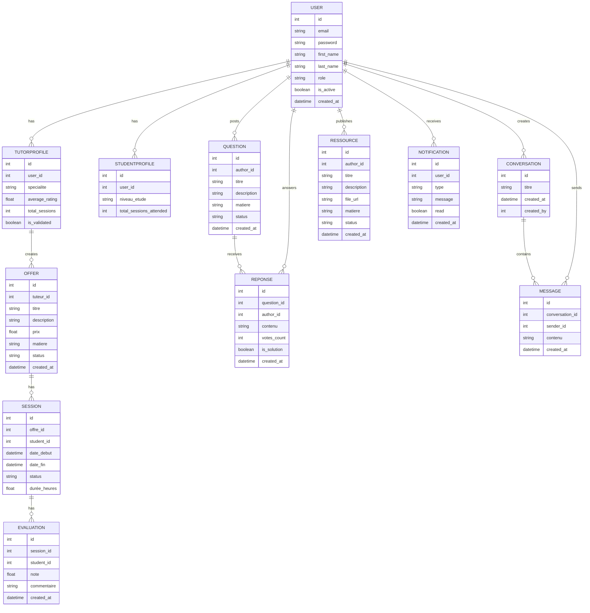
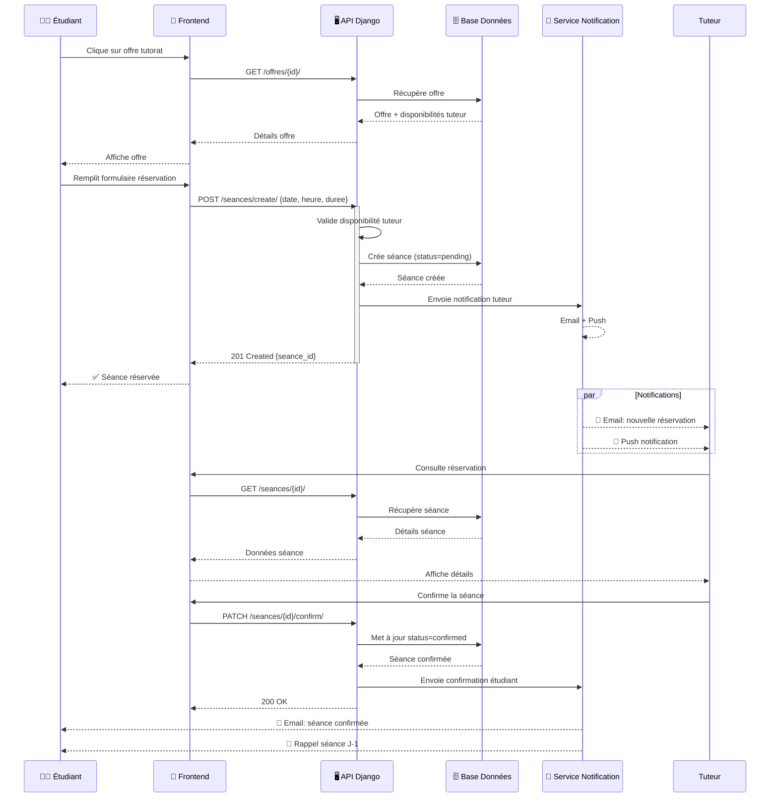
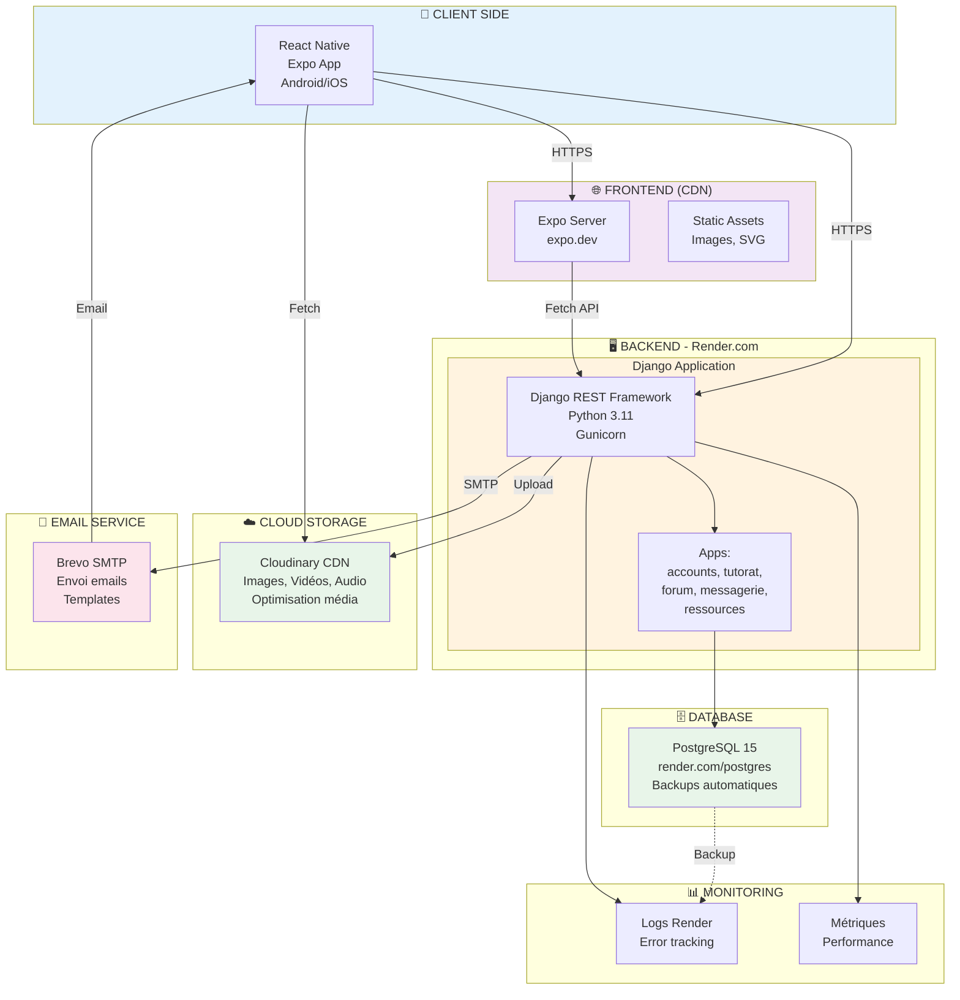
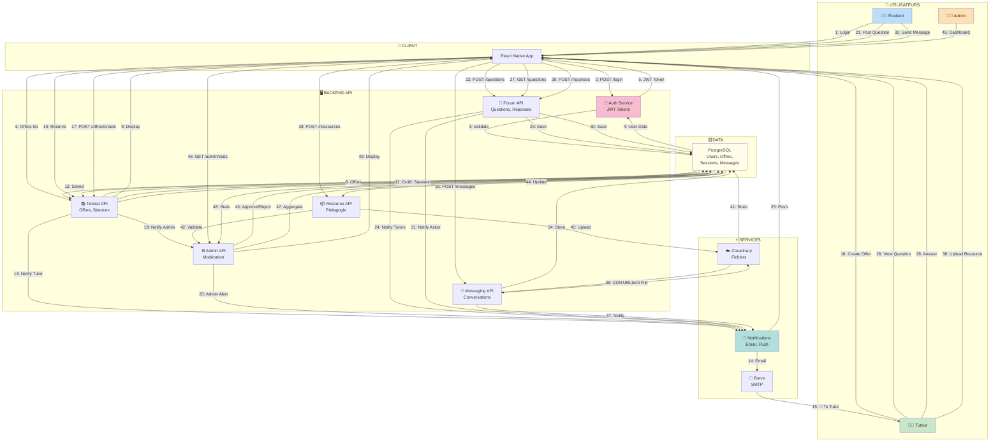
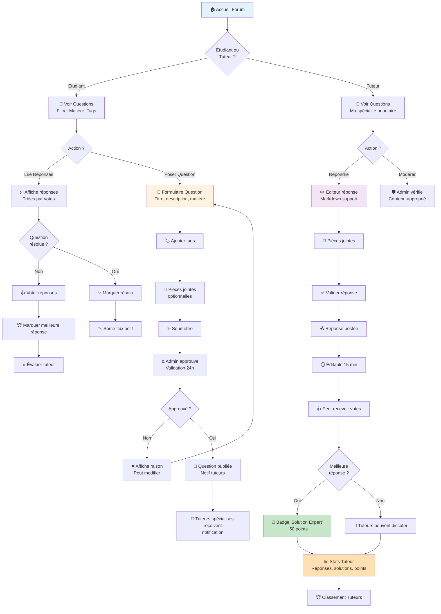

# 📐 Diagrammes UML Complets - Plateforme de Tutorat

## 1️⃣ DIAGRAMME DE CAS D'UTILISATION (Use Case Diagram)

```mermaid
graph TB
    %% Acteurs
    A[👨‍🎓 Étudiant]
    T[👨‍🏫 Tuteur]
    Admin[👨‍💼 Admin]
    E[👨‍🏫 Enseignant]

    %% Cas d'utilisation pour Étudiant
    A -->|S'authentifier| Auth["🔐 S'authentifier"]
    A -->|Rechercher tuteurs| SearchTutors["🔍 Rechercher Offres Tuteur"]
    A -->|Réserver séance| BookSession["📅 Réserver Séance"]
    A -->|Poser question| PostQuestion["❓ Poser Question Forum"]
    A -->|Voter réponses| VoteAnswer["👍 Voter Réponse"]
    A -->|Échanger messages| Message["💬 Messagerie"]
    A -->|Télécharger ressources| DownloadRes["⬇️ Télécharger Ressources"]
    A -->|Évaluer tuteur| RateTutor["⭐ Évaluer Tuteur"]

    %% Cas d'utilisation pour Tuteur
    T -->|S'authentifier| Auth
    T -->|Soumettre demande| RequestTutor["📝 Demander Devenir Tuteur"]
    T -->|Créer offre| CreateOffer["✨ Créer Offre Tutorat"]
    T -->|Gérer disponibilités| ManageAvail["🗓️ Gérer Disponibilités"]
    T -->|Confirmer séance| ConfirmSession["✅ Confirmer Séance"]
    T -->|Répondre questions| AnswerQ["✏️ Répondre Questions Forum"]
    T -->|Partager ressources| ShareRes["📤 Partager Ressources"]
    T -->|Voir statistiques| ViewStats["📊 Voir Statistiques"]

    %% Cas d'utilisation pour Admin
    Admin -->|Valider offres| ValidateOffer["🔏 Valider Offre Tutorat"]
    Admin -->|Approuver tuteurs| ApproveTutor["✔️ Approuver Tuteur"]
    Admin -->|Modérer contenu| Moderate["🛡️ Modérer Contenu"]
    Admin -->|Voir dashboard| Dashboard["📈 Dashboard Admin"]
    Admin -->|Gérer utilisateurs| ManageUsers["👥 Gérer Utilisateurs"]

    %% Cas d'utilisation pour Enseignant
    E -->|S'authentifier| Auth
    E -->|Créer offre| CreateOffer
    E -->|Partager ressources| ShareRes
    E -->|Modérer contenu| Moderate

    %% Cas d'utilisation partagés (extends)
    ViewStats -.->|généré à partir| BookSession
    ViewStats -.->|généré à partir| AnswerQ
    Dashboard -.->|accède à| ValidateOffer
    Dashboard -.->|accède à| ApproveTutor

    style Auth fill:#e1f5ff
    style SearchTutors fill:#fff3e0
    style BookSession fill:#f3e5f5
    style Message fill:#e8f5e9
    style ValidateOffer fill:#ffebee
    style ViewStats fill:#fce4ec
```



---

## 2️⃣ DIAGRAMME DE CLASSES / BASE DE DONNÉES (Entity Relationship)



---

## 3️⃣ DIAGRAMME DE SÉQUENCE - Réservation Séance Tutorat



---

## 4️⃣ DIAGRAMME D'ACTIVITÉ - Workflow Publication Ressource Pédagogique

```mermaid
stateDiagram-v2
    [*] --> SelectRessource: Tuteur upload ressource
    
    SelectRessource --> ValidateFile: Système valide type fichier
    ValidateFile --> FileValid{Fichier\nvalide ?}
    
    FileValid -->|Non| ErrorMsg: ❌ Affiche erreur
    ErrorMsg --> [*]
    
    FileValid -->|Oui| Upload: ⬆️ Upload sur Cloudinary
    Upload --> Uploaded{Upload\nréussi ?}
    
    Uploaded -->|Échoué| ErrorMsg
    Uploaded -->|Succès| FillMetadata: 📝 Remplir métadonnées
    
    FillMetadata --> SelectMatiere: Choisir matière
    SelectMatiere --> AddDescription: Ajouter description
    AddDescription --> SelectCategory: Catégorie
    SelectCategory --> SetPermissions: Définir permissions (public/privé)
    SetPermissions --> SubmitForValidation: 🚀 Soumettre validation
    
    SubmitForValidation --> AdminReview{Admin\nvalide ?}
    
    AdminReview -->|Rejet| RejectionReason: ⛔ Raison rejet
    RejectionReason --> CanEdit{Peut\nmodifier ?}
    CanEdit -->|Oui| FillMetadata
    CanEdit -->|Non| [*]
    
    AdminReview -->|Approbation| Publish: ✅ Publier ressource
    Publish --> IndexDB: 🔍 Indexer base de données
    IndexDB --> NotifyTeachers: 📢 Notifier enseignants abonnés
    NotifyTeachers --> AvailableResource: 📚 Ressource disponible
    AvailableResource --> [*]
```

---

## 5️⃣ DIAGRAMME DE DÉPLOIEMENT (Deployment Diagram)



---

## 6️⃣ DIAGRAMME DE COMMUNICATION (Communication Diagram)



---

## 7️⃣ DIAGRAMME DE FLUX D'ACTIVITÉ - Forum Pédagogique Complet



---

## 📋 RÉSUMÉ DES DIAGRAMMES

| Diagramme | Format | Utilité | Destinataires |
|-----------|--------|---------|-----------------|
| **Cas d'utilisation** | Use Case | Montre tous les acteurs et leurs actions | Parties prenantes, professeurs |
| **Classes/Base de données** | Entity-Relationship | Architecture données complète | Développeurs, DBAs |
| **Séquence** | Sequence | Détail flux réservation séance | Techniques |
| **Activité** | Activity | Workflow publication ressource | Tous (facile à comprendre) |
| **Déploiement** | Deployment | Infrastructure cloud, Render | DevOps, administrateurs |
| **Communication** | Communication | Interactions entre composants | Architectes, leads |
| **Activité Forum** | Activity | Processus complet du forum | Tous (fonctionnel) |

---

## 🚀 COMMENT UTILISER CES DIAGRAMMES DANS VOTRE MÉMOIRE

### Option 1 : Export en Images
```bash
# Avec Mermaid CLI
npm install -g @mermaid-js/mermaid-cli
mmdc -i DIAGRAMMES_UML_COMPLETS.md -o diagrammes/

# Avec PlantUML online
# Copier-coller le code Mermaid sur https://mermaid.live
```

### Option 2 : Intégration Directe
```markdown
# Dans votre rapport .md ou .docx:

```

### Option 3 : Présentation interactive
- Ouvrir https://mermaid.live
- Copier-coller chaque code
- Exporter en SVG haute résolution

---

## 💡 POINTS CLÉS À METTRE EN AVANT DANS LE MÉMOIRE

✅ **Architecture modulaire** : 5 apps Django indépendantes  
✅ **Scalabilité** : Déploiement cloud (Render), CDN (Cloudinary)  
✅ **Sécurité** : JWT, validation permissions par rôle  
✅ **UX** : Notifications temps-réel, gamification  
✅ **Résilience** : Backups PostgreSQL automatiques  

---

**Généré avec Mermaid Diagram Syntax v10 - Compatible PlantUML/Lucidchart**
