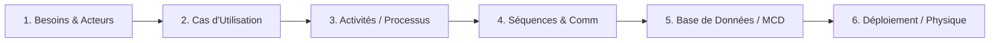
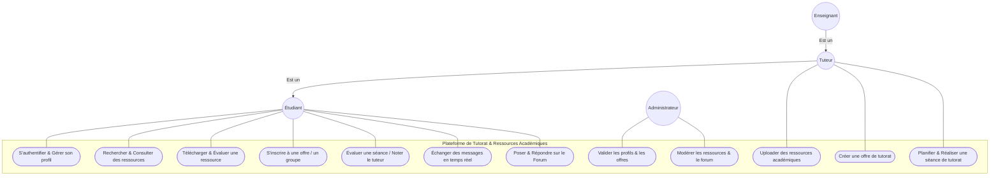
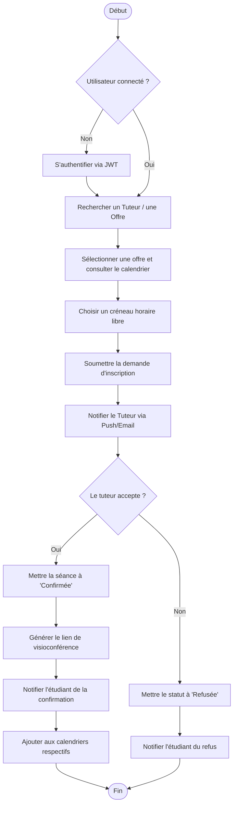
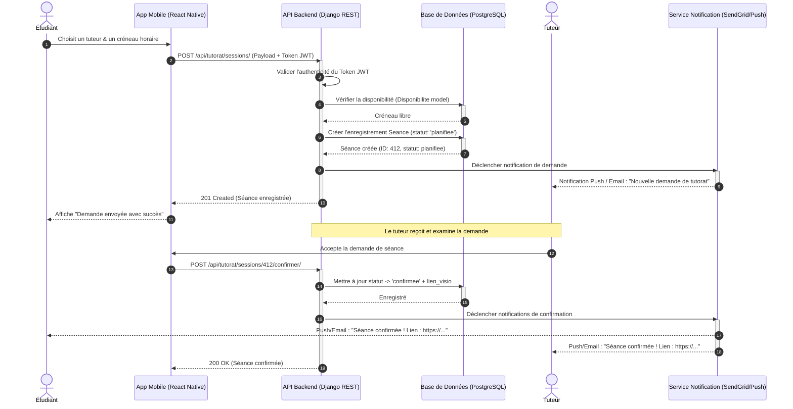
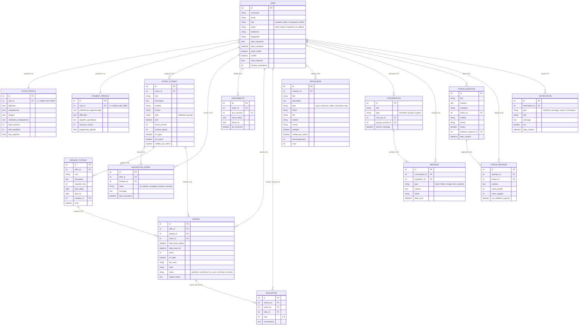
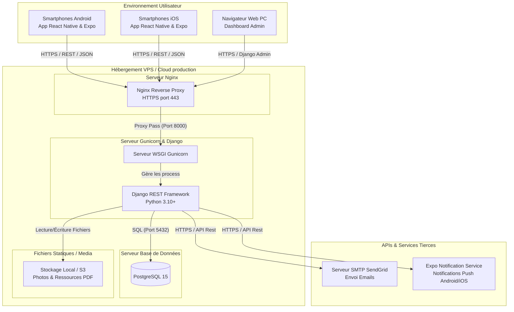

# 📊 Guide Complet d'Analyse et de Conception UML
## Projet : Plateforme de Tutorat Académique et de Partage de Ressources

Ce guide a été conçu pour structurer et générer l'ensemble des diagrammes requis pour votre **Projet de Fin d'Études (PFE)**. Il détaille la méthodologie d'analyse et fournit les codes sources au format **Mermaid.js**, que vous pouvez visualiser directement dans votre éditeur Markdown (comme VS Code, GitHub ou des visionneuses Mermaid en ligne).

---

## 🎯 1. Méthodologie : Comment Procéder ?

Pour concevoir votre rapport de PFE et modéliser correctement votre application, vous devez suivre une démarche de génie logiciel structurée (généralement inspirée du Processus Unifié ou de Scrum). Voici l'ordre logique de réalisation de vos diagrammes :



### Étapes clés :
1. **Identifier les acteurs (Qui ?)** :
   - **Étudiant** : Recherche des tuteurs, s'inscrit aux séances, télécharge des ressources, participe au forum.
   - **Tuteur** : Propose des offres de tutorat, valide/organise les séances, dépose des ressources.
   - **Enseignant** : Rôle similaire au tuteur avec des privilèges académiques supplémentaires (validation immédiate).
   - **Administrateur** : Valide les profils de tuteur, modère le forum, supervise la plateforme.
2. **Définir les fonctionnalités clés (Quoi ?)** : Cartographiées par le **Diagramme de Cas d'Utilisation**.
3. **Modéliser les flux opérationnels (Comment ?)** : Modélisés par les **Diagrammes d'Activités** (aspect dynamique global).
4. **Modéliser les interactions techniques chronologiques** : Modélisées par les **Diagrammes de Séquence** et de **Communication** (échanges de messages, requêtes HTTP/JWT).
5. **Concevoir la structure des données** : Modélisée par le **Diagramme de Classe / MCD / Base de Données** (basé sur vos modèles Django).
6. **Concevoir l'infrastructure physique** : Modélisée par le **Diagramme de Déploiement** (React Native, Django, PostgreSQL, SendGrid).

---

## 👥 2. Diagramme de Cas d'Utilisation (Use Case Diagram)

Ce diagramme structure les fonctionnalités de la plateforme selon le rôle de chaque acteur.



---

## 🔄 3. Diagramme d'Activité (Activity Diagram)

Ce diagramme représente le flux de contrôle lors de la **Réservation et validation d'une séance de tutorat**.



---

## ⏱️ 4. Diagramme de Séquence (Sequence Diagram)

Modélise le scénario de **Réservation d'une séance de tutorat** avec passage de jetons d'authentification (JWT).



---

## 🗣️ 5. Diagramme de Communication (Communication Diagram)

Ce diagramme montre les mêmes interactions que le diagramme de séquence ci-dessus, mais se focalise sur l'organisation structurelle des objets.

```mermaid
flowchart TD
    Student((Étudiant)) -- "1: Demander une séance\n5: Recevoir confirmation" --- AppMobile[App Mobile (React Native)]
    AppMobile -- "2: POST /api/tutorat/sessions/\n4: Retourner confirmation (201)" --- DjangoAPI[API Backend (Django REST)]
    DjangoAPI -- "3.1: Insérer Séance\n3.3: Mettre à jour statut" --- Database[(PostgreSQL DB)]
    DjangoAPI -- "3.2: Envoyer notification" --- NotificationServer[Serveur de Notifications]
    NotificationServer -- "3.2.1: Recevoir alerte" --- Tutor((Tuteur))
    Tutor -- "3.2.2: Accepter séance" --- AppMobile
```

---

## 🗄️ 6. Diagramme de Base de Données (Entity-Relationship Diagram - MCD)

Ce diagramme représente la structure physique et logique de votre base de données PostgreSQL, mappée sur vos modèles Django réels décrits dans [BACKEND_MODELS_COMPLETS.md](file:///c:/Users/Agathe/OneDrive/Desktop/APPLICATION_TUTORAT/BACKEND_MODELS_COMPLETS.md).



---

## 🖥️ 7. Diagramme de Déploiement (Deployment Diagram)

Ce diagramme modélise l'architecture physique de production pour le déploiement de l'application.



---

## 🛠️ 8. Outils Recommandés pour la Rédaction de Votre Rapport

Pour insérer ces diagrammes dans votre document de thèse de PFE (Word ou LaTeX) :
1. **DBeaver ou pgAdmin** : Pour générer automatiquement le schéma physique directement depuis votre base de données PostgreSQL locale.
2. **Mermaid Live Editor** ([mermaid.live](https://mermaid.live)) : Collez le code Mermaid de ce fichier pour exporter directement les diagrammes en **PNG haute résolution**, **SVG** ou **PDF**.
3. **Draw.io (ou app.diagrams.net)** : Outil gratuit pour redessiner ou enrichir manuellement les diagrammes si nécessaire.
4. **StarUML / Modelio** : Si votre école exige un formalisme strict avec vérification des contraintes UML.
