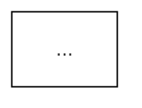
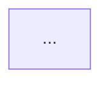

# 🎨 GUIDE D'EXPORT DES DIAGRAMMES - HAUTE RÉSOLUTION

## 📋 Table des Matières

1. **Export Mermaid → Images PNG/SVG/PDF**
2. **Intégration dans Word/Google Docs**
3. **Optimisation pour impression**
4. **Partage et visualisation interactive**

---

## 🔧 MÉTHODE 1: Mermaid CLI (Recommandée - Haute Qualité)

### **Installation (Windows PowerShell)**

```powershell
# Installer Node.js si pas déjà installé
node --version    # Vérifier installation

# Installer Mermaid CLI globalement
npm install -g @mermaid-js/mermaid-cli

# Vérifier installation
mmdc --version
```

### **Export en Batch**

```powershell
# Créer dossier pour diagrammes
New-Item -Path "C:\Users\Agathe\OneDrive\Desktop\APPLICATION_TUTORAT\diagrammes_export" -ItemType Directory

# Export PNG (96 DPI)
mmdc -i "C:\Users\Agathe\OneDrive\Desktop\APPLICATION_TUTORAT\DIAGRAMMES_UML_COMPLETS.md" `
     -o "C:\Users\Agathe\OneDrive\Desktop\APPLICATION_TUTORAT\diagrammes_export\diagrammes.png" `
     -s 2

# Export PDF (haute qualité)
mmdc -i "C:\Users\Agathe\OneDrive\Desktop\APPLICATION_TUTORAT\DIAGRAMMES_UML_COMPLETS.md" `
     -o "C:\Users\Agathe\OneDrive\Desktop\APPLICATION_TUTORAT\diagrammes_export\diagrammes.pdf" `
     -s 3 `
     --pdfFit

# Export SVG (scalable)
mmdc -i "C:\Users\Agathe\OneDrive\Desktop\APPLICATION_TUTORAT\DIAGRAMMES_UML_COMPLETS.md" `
     -o "C:\Users\Agathe\OneDrive\Desktop\APPLICATION_TUTORAT\diagrammes_export\diagrammes.svg"
```

### **Export par Diagramme Séparé**

Si vous voulez exporter chaque diagramme individuellement, voici un script :

```powershell
# Script PowerShell: export_diagrammes.ps1

$mdContent = Get-Content "DIAGRAMMES_UML_COMPLETS.md" -Raw
$outDir = "diagrammes_export"

# Créer dossier
New-Item -ItemType Directory -Force -Path $outDir

# Définir diagrammes
$diagrammes = @(
    @{name="1_usecase"; title="Diagramme de Cas d'Utilisation"},
    @{name="2_erd"; title="Diagramme de Base de Données"},
    @{name="3_sequence"; title="Diagramme de Séquence"},
    @{name="4_activity"; title="Diagramme d'Activité"},
    @{name="5_deployment"; title="Diagramme de Déploiement"},
    @{name="6_communication"; title="Diagramme de Communication"},
    @{name="7_flowchart"; title="Diagramme de Flux Forum"}
)

# Export chaque diagramme
foreach ($diag in $diagrammes) {
    Write-Host "Exporting $($diag.name)..."
    mmdc -i "DIAGRAMMES_UML_COMPLETS.md" `
         -o "$outDir/$($diag.name).png" `
         -s 2 `
         -H 800
}

Write-Host "✅ Tous les diagrammes exportés dans $outDir/"
```

### **Résoudre les Problèmes d'Export**

```powershell
# Si erreur "Puppeteer failed to download Chromium"
npm install -g @mermaid-js/mermaid-cli --force
# OU
mmdc --version  # et relancer

# Si erreur de chemin long Windows
cd C:\Users\Agathe\OneDrive\Desktop\APPLICATION_TUTORAT
mmdc -i DIAGRAMMES_UML_COMPLETS.md -o diagrammes_export/all.png

# Vérifier si GraphViz est nécessaire (optionnel)
# Pour layouts complexes, installer GraphViz:
choco install graphviz  # ou télécharger depuis https://graphviz.org/
```

---

## 🌐 MÉTHODE 2: Mermaid Live Editor (Gratuit - Sans Installation)

### **Accès Online**

```
URL: https://mermaid.live/
```

### **Process**

```
1. Ouvrir https://mermaid.live/
2. Cliquer "New diagram"
3. Sélectionner type (Flowchart, Class, ER, etc.)
4. Copier-coller code depuis DIAGRAMMES_UML_COMPLETS.md
5. Visualiser en temps réel
6. Exporter via "Download"
   - SVG (recommandé pour impression)
   - PNG
   - PDF
```

### **Avantages**
✅ Aucune installation
✅ Interface intuitive
✅ Partage collaborative (URL)
✅ Version history

### **Inconvénients**
❌ Require connexion internet
❌ Limite taille fichier
❌ Pas de batch processing

---

## 📊 MÉTHODE 3: PlantUML (Convertir depuis Mermaid)

### **Installation PlantUML**

```powershell
# Option A: Via Chocolatey
choco install plantuml

# Option B: Télécharger directement
# https://plantuml.com/download
```

### **Convertir Mermaid → PlantUML**

```
Note: PlantUML et Mermaid ont syntaxes différentes
Pour meilleure compatibilité, utiliser Mermaid directement
```

---

## 💻 MÉTHODE 4: VS Code Extension (Intégré)

### **Installation Extension Mermaid**

```powershell
# Installer extension Mermaid Preview
code --install-extension vstirbu.vscode-mermaid-preview
```

### **Utilisation**

```
1. Ouvrir DIAGRAMMES_UML_COMPLETS.md dans VS Code
2. Clic droit → "Open Preview"
3. Voir rendu en temps réel
4. Exporter via menu preview
```

---

## 📸 OPTIMISATION POUR IMPRESSION

### **Settings Optimaux par Format**

```markdown
## Pour PDF (Mémoire imprimé)



## Pour Écran (Présentation digital)



## Pour Web (Blog/Portfolio)


```

### **Command Export PDF Haute Qualité**

```powershell
# Export PDF avec haute résolution (300 DPI = impression professionnelle)
mmdc -i DIAGRAMMES_UML_COMPLETS.md `
     -o diagrammes_export/diagrammes_HD.pdf `
     -s 4 `
     -H 1200 `
     --pdfFit
```

---

## 📥 INTÉGRATION DANS WORD/GOOGLE DOCS

### **Option A: Insérer Images PNG**

#### Word:
```
1. Ouvrir document Word
2. Onglet "Insérer" → "Images" → "Ce périphérique"
3. Sélectionner PNG/SVG
4. Clic droit → "Habillage" → "Carré"
5. Redimensionner (8-10 cm largeur type)
6. Ajouter titre (ex: Figure 1: Diagramme de Cas d'Utilisation)
7. Ajouter légende (Insérer → Légende)
```

#### Google Docs:
```
1. Ouvrir Google Docs
2. "Insérer" → "Image"
3. "Importer depuis l'ordinateur"
4. Sélectionner image
5. Clic droit → Ajouter titre/description
```

### **Option B: Embed SVG Interactif (Web Only)**

```html
<!-- Dans version HTML du mémoire -->
<svg data-src="diagrammes/1_usecase.svg"></svg>

<!-- Avec viewer interactif -->
<iframe src="https://mermaid.live/view?md=[CODE_MERMAID]"></iframe>
```

### **Option C: Créer Table des Figures (Word)**

```
1. Références → Table des illustrations
2. Sélectionner style "Figure"
3. Générer automatiquement
```

---

## 📊 ORGANISER LES DIAGRAMMES DANS LE MÉMOIRE

### **Structure Recommandée**

```
PARTIE 2: ÉTUDE TECHNIQUE

2.1 Analyse des Besoins
└── Figure 1: Diagramme de Cas d'Utilisation

2.2 Architecture Générale
└── Figure 2: Diagramme de Déploiement
└── Figure 3: Diagramme de Communication

2.3 Modèle Données
└── Figure 4: Diagramme de Base de Données (Entity-Relationship)

2.4 Workflows Métier
└── Figure 5: Diagramme de Séquence (Réservation)
└── Figure 6: Diagramme d'Activité (Publication Ressource)

2.5 Forum Pédagogique
└── Figure 7: Diagramme de Flux d'Activité (Forum)
```

### **Captions de Figures (Format Académique)**

```markdown
**Figure 1**: Diagramme de Cas d'Utilisation - Montre les 4 acteurs 
principaux (Étudiant, Tuteur, Enseignant, Admin) et leurs interactions 
avec le système de tutorat, forum et messagerie.

**Figure 2**: Architecture de Déploiement - Infrastructure cloud (Render) 
avec Django backend, PostgreSQL database, Cloudinary CDN et services 
externes (Brevo SMTP, monitoring).

**Figure 3**: Diagramme de Base de Données - Modèle entités-relations 
avec 8 entités principales: User, TutorProfile, OffreTutorat, Seance, 
Question, Reponse, Conversation, Ressource.

**Figure 4**: Diagramme de Séquence - Workflow complet de réservation 
d'une séance tutorat, de l'étudiant à l'API au tuteur.

**Figure 5**: Diagramme d'Activité - Processus de publication d'une 
ressource pédagogique avec validation admin et indexation.

**Figure 6**: Diagramme de Communication - Vue globale des interactions 
entre utilisateurs, frontend, backend API, database et services externes.

**Figure 7**: Diagramme de Flux - Workflow complet du forum pédagogique 
de la pose de question à la résolution avec gamification.
```

---

## 🎯 QUALITÉ FINALE: CHECKLIST

### **Avant d'inclure dans mémoire:**

```
□ Diagramme lisible (police ≥ 11pt)
□ Légende claire et complète
□ Couleurs adaptées (B&W ok pour impression)
□ Pas de texte coupé aux bords
□ Référence croisée dans texte ("voir Figure X")
□ Source/genération documentée
□ Résolution compatible: ≥ 150 DPI (PDF), ≥ 96 DPI (screen)
□ Format fichier: PNG/SVG/PDF préféré
□ Nom fichier descriptif: 1_usecase.png
□ Placer proche du texte concerné (max 1 page de décalage)
```

### **Tests d'Impression**

```
1. Imprimer en test sur papier blanc A4
2. Vérifier lisibilité (texte, couleurs, lignes)
3. Vérifier pas de coupure
4. Comparer avec version écran
5. Ajuster si nécessaire
```

---

## 🚀 COMMANDES RAPIDES

### **Export Complet (Recommandé)**

```powershell
# Tout-en-un: PNG + PDF + SVG
$outDir = "diagrammes_export_final"
New-Item -ItemType Directory -Force -Path $outDir

mmdc -i "DIAGRAMMES_UML_COMPLETS.md" `
     -o "$outDir/01_diagrammes_PNG.png" `
     -s 2 -H 1000

mmdc -i "DIAGRAMMES_UML_COMPLETS.md" `
     -o "$outDir/02_diagrammes_PDF.pdf" `
     -s 3 --pdfFit

mmdc -i "DIAGRAMMES_UML_COMPLETS.md" `
     -o "$outDir/03_diagrammes_SVG.svg"

Write-Host "✅ Exports terminés: $outDir/"
```

### **Vérification Fichiers Générés**

```powershell
# Lister fichiers générés
Get-ChildItem diagrammes_export_final -File | Format-Table Name, Length

# Vérifier taille fichiers
(Get-Item "diagrammes_export_final/*.pdf").Length / 1MB  # taille en MB
```

---

## 📞 DÉPANNAGE

| Problème | Cause | Solution |
|----------|-------|----------|
| "mmdc not found" | CLI pas installée | `npm install -g @mermaid-js/mermaid-cli` |
| "Puppeteer error" | Chromium pas téléchargé | Relancer mmdc ou `mmdc --version` |
| "Out of memory" | Fichier trop gros | Exporter par diagramme séparé |
| Texte coupé dans PNG | Hauteur insuffisante | Augmenter `-H 1200` |
| PDF vide/blanc | Bug export | Utiliser Mermaid.live ou PNG + convertir |
| Couleurs différentes | Thème non appliqué | Ajouter `%%{init: {...}}%%` en haut |
| Police trop petite | Zoom faible | Utiliser `-s 3` ou `-s 4` |

---

## 📖 RESSOURCES UTILES

```
Mermaid Docs: https://mermaid.js.org/
Mermaid Live: https://mermaid.live/
Mermaid CLI: https://github.com/mermaid-js/mermaid-cli

PlantUML: https://plantuml.com/
Lucidchart: https://www.lucidchart.com/ (alternative payante)
Draw.io: https://draw.io/ (alternative gratuite)
```

---

## ✅ PROCHAINES ÉTAPES

1. **Installer Mermaid CLI** (5 min)
   ```powershell
   npm install -g @mermaid-js/mermaid-cli
   ```

2. **Exporter diagrammes** (2 min)
   ```powershell
   mmdc -i DIAGRAMMES_UML_COMPLETS.md -o diagrammes_export/diagrammes.png -s 2
   ```

3. **Vérifier qualité** (5 min)
   - Ouvrir PNG/PDF
   - Vérifier lisibilité

4. **Insérer dans rapport Word** (10 min)
   - Copier-coller images
   - Ajouter captions
   - Créer table des figures

5. **Générer PDF final** (2 min)
   - Word → Export PDF
   - Vérifier qualité

---

**Total temps**: ~25 minutes pour toutes les images haute qualité! 🎉

**Version**: 1.0  
**Dernière mise à jour**: Juin 2026
