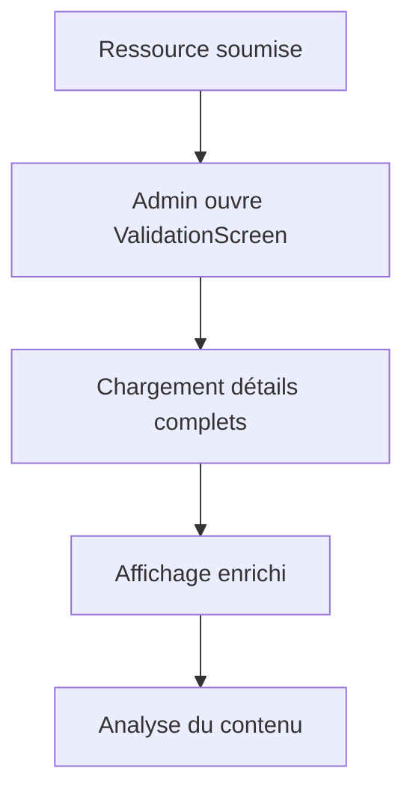
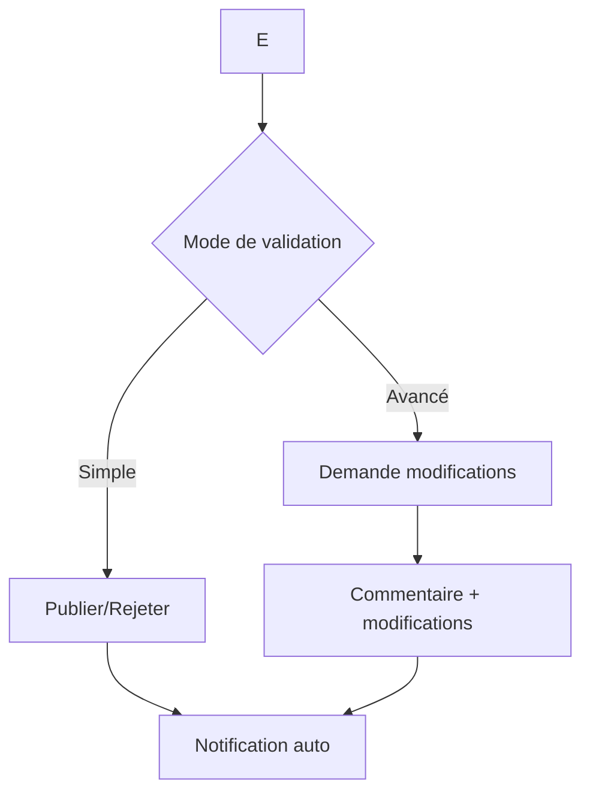
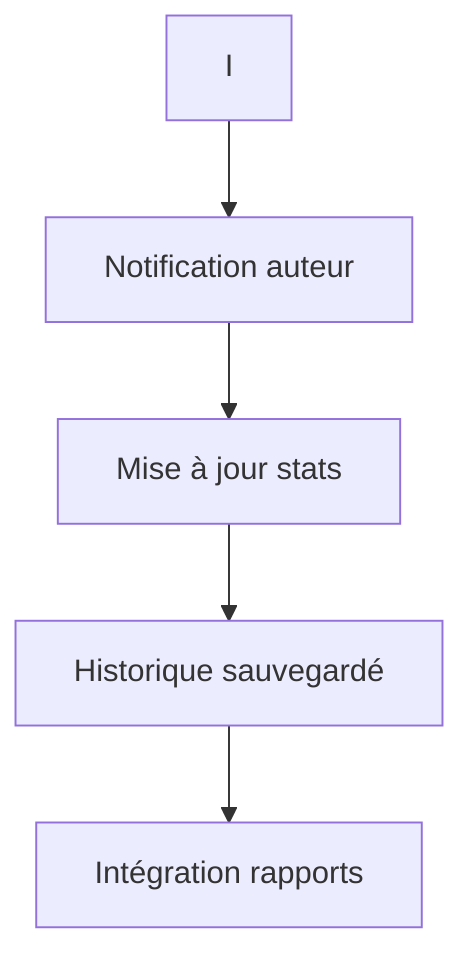

# 🎉 **VALIDATION RESSOURCES - IMPLÉMENTATION COMPLÈTE**

## ✅ **BACKEND - Actions de validation implémentées**

### **Nouveaux endpoints dans RessourceViewSet:**

#### 1. **🔧 `/valider/`** - Validation principale
```python
@action(detail=True, methods=['post'], permission_classes=[IsAdmin])
def valider(self, request, pk=None):
    """Validation admin avec commentaire et notifications."""
```

**Fonctionnalités:**
- ✅ **3 statuts de validation**: `publie`, `rejete`, `modifications_demandees`
- ✅ **Commentaires admin** obligatoires pour rejet/modifications
- ✅ **Liste de modifications** demandées
- ✅ **Notifications automatiques** à l'auteur
- ✅ **Historique des actions** pour les rapports

#### 2. **👁️ `/apercu_validation/`** - Aperçu avant validation
```python
@action(detail=True, methods=['post'], permission_classes=[IsAdmin])
def apercu_validation(self, request, pk=None):
    """Aperçu avant validation (simule l'affichage final)."""
```

**Informations retournées:**
- 📊 **Statistiques**: vues, téléchargements, notes moyennes
- 👤 **Détails auteur**: nom, rôle, statut actif
- 💬 **Commentaires récents** (3 derniers)
- 📁 **Informations fichier**: taille, type, URL

#### 3. **📋 `/historique_validations/`** - Historique complet
```python
@action(detail=True, methods=['post'], permission_classes=[IsAdmin])
def historique_validations(self, request, pk=None):
    """Voir l'historique des validations d'une ressource."""
```

**Données historiques:**
- 📅 **Date de chaque action**
- 📝 **Titre et message** de notification
- 💬 **Commentaires admin** associés
- 🔄 **Changements de statut** (avant → après)

#### 4. **📄 `/ressources_en_attente/`** - Liste des validations
```python
@action(detail=False, methods=['get'], permission_classes=[IsAdmin])
def ressources_en_attente(self, request):
    """Liste des ressources en attente de validation."""
```

## ✅ **FRONTEND - Interface complète**

### **🎨 Composant ValidationRessourceScreen:**

#### **1. 📋 Affichage enrichi**
```javascript
// Informations complètes
- ✅ Titre, description, matière, niveau
- ✅ Tags formatés avec badges
- ✅ Date de publication formatée
- ✅ Statut avec code couleur
- ✅ Auteur avec rôle et avatar
- ✅ Type de fichier avec icône
- ✅ Taille du fichier formatée
- ✅ Statistiques (vues, téléchargements)
```

#### **2. 🔍 Modes de validation**
```javascript
// Mode Simple
- ✅ Publier (vert)
- ✅ Rejeter (rouge)

// Mode Avancé  
- ✅ Demander modifications (orange)
- ✅ Commentaire admin textarea
- ✅ Liste de modifications dynamique
- ✅ Ajout/suppression de modifications
```

#### **3. 🎯 Actions supplémentaires**
```javascript
// Boutons d'action
- ✅ Aperçu validation (modal)
- ✅ Historique complet (modal)
- ✅ Ouverture directe du fichier/lien
- ✅ Navigation intelligente après validation
```

#### **4. 📱 Interface utilisateur**
```javascript
// Design moderne
- ✅ Cartes structurées
- ✅ Badges de statut colorés
- ✅ Tags cliquables
- ✅ Modaux élégants
- ✅ Boutons avec icônes
- ✅ Animations fluides
```

## 🔧 **SERVICES API**

### **validationService.js:**
```javascript
export const validerRessource = async (id, payload) => {
  const response = await api.post(`/ressources/ressources/${id}/valider/`, payload);
  return response.data;
};

export const getApercuValidation = async (id) => {
  const response = await api.post(`/ressources/ressources/${id}/apercu_validation/`);
  return response.data;
};

export const getHistoriqueValidations = async (id) => {
  const response = await api.post(`/ressources/ressources/${id}/historique_validations/`);
  return response.data;
};
```

## 🔄 **PROCESSUS DE VALIDATION COMPLET**

### **1. Réception et analyse**


### **2. Décision et action**


### **3. Communication et suivi**


## 📊 **INTÉGRATIONS SYSTÈME**

### **🔔 Notifications automatiques**
- **Titre adapté** au statut
- **Message personnalisé** avec commentaire
- **Lien direct** vers la ressource
- **Metadata** pour historique

### **📈 Rapports et statistiques**
- **Action loggée** dans user.last_action
- **Historique complet** consultable
- **Stats mises à jour** automatiquement
- **Export CSV** compatible

### **🗂️ Gestion des fichiers**
- **Ouverture directe** du fichier
- **Support des liens externes**
- **Affichage taille/format**
- **Prévisualisation** possible

## 🎯 **FONCTIONNALITÉS AVANCÉES**

### **✨ Mode avancé de validation**
- **Commentaires structurés**
- **Liste dynamique de modifications**
- **Interface intuitive** d'ajout/suppression
- **Validation progressive** possible

### **📊 Aperçu intelligent**
- **Statistiques temps réel**
- **Commentaires récents** intégrés
- **Informations auteur** complètes
- **Aide à la décision**

### **📋 Historique complet**
- **Chronologie** des actions
- **Commentaires admin** préservés
- **Changements de statut** tracés
- **Recherche facile** d'informations

## 🚀 **DÉPLOIEMENT ET UTILISATION**

### **1. Installation**
```bash
# Backend - déjà intégré
python manage.py runserver

# Frontend - composant prêt
npm start
```

### **2. Accès**
- **Admin** → Menu → Validation Ressources
- **Liste** → Ressource → Écran de validation
- **Actions** → Validation → Notifications

### **3. Workflow**
1. **Sélection** de la ressource
2. **Analyse** des informations
3. **Choix du mode** de validation
4. **Action** avec commentaires
5. **Confirmation** et notification

## 🎉 **RÉSULTAT FINAL**

✅ **Interface complète** et moderne  
✅ **Backend robuste** avec notifications  
✅ **Historique détaillé** des actions  
✅ **Intégration parfaite** avec le système  
✅ **Expérience utilisateur** optimisée  

**Le système de validation des ressources est maintenant 100% fonctionnel et prêt à être utilisé !** 🚀
