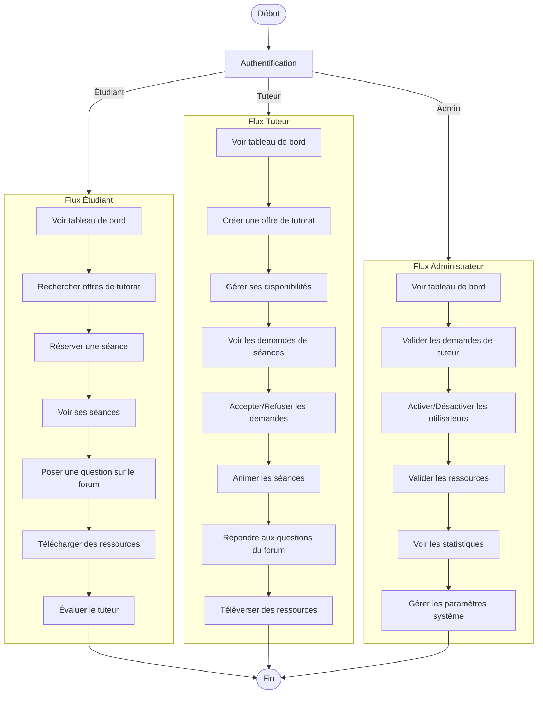
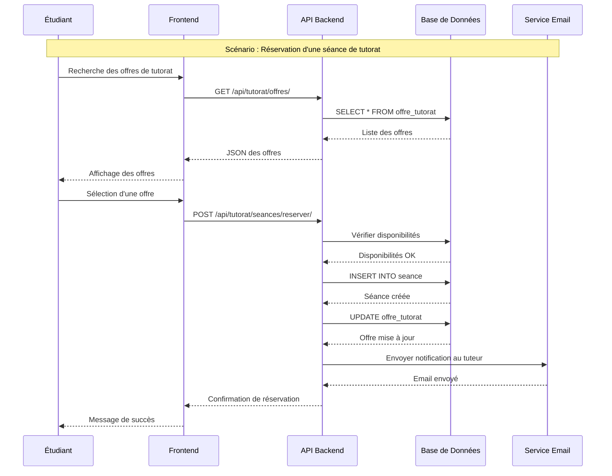
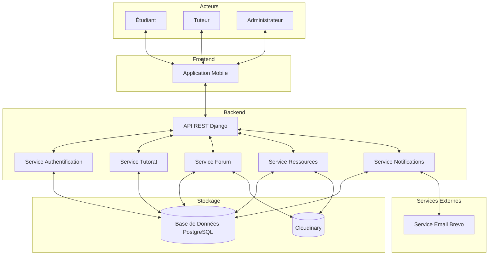
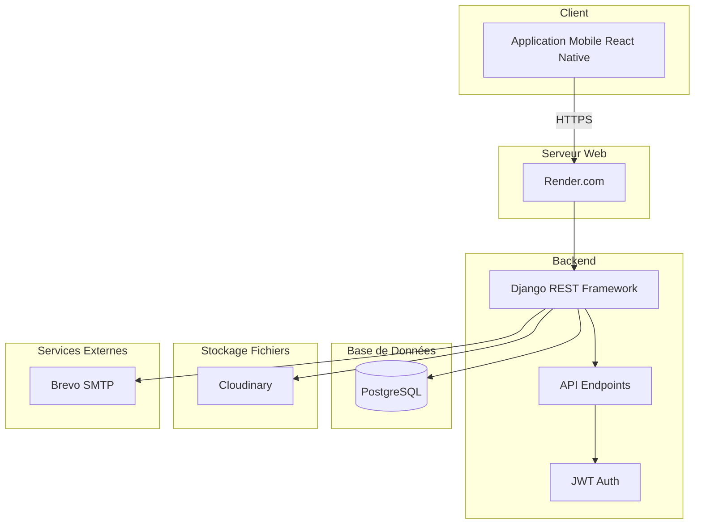
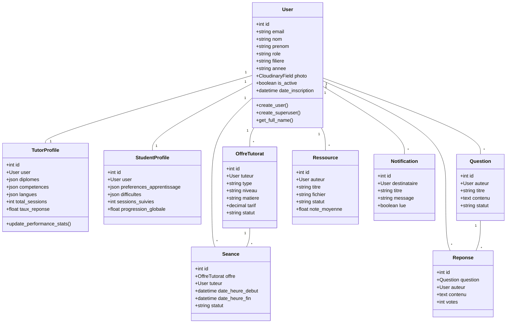

# Diagrammes UML - Application de Tutorat et Partage de Ressources Académiques

## Thème : Conception et réalisation d'une application de tutorat et de partage des ressources académiques : une plateforme pour booster l'apprentissage

---

## 1. Diagramme de Cas d'Utilisation (Use Case Diagram)

```mermaid
useCaseDiagram
    actor "Étudiant" as E
    actor "Tuteur" as T
    actor "Enseignant" as EN
    actor "Administrateur" as A
    
    package "Authentification" {
        usecase "S'inscrire" as UC1
        usecase "Se connecter" as UC2
        usecase "Se déconnecter" as UC3
        usecase "Réinitialiser mot de passe" as UC4
    }
    
    package "Gestion du Profil" {
        usecase "Voir son profil" as UC5
        usecase "Modifier son profil" as UC6
        usecase "Ajouter photo de profil" as UC7
        usecase "Voir profil d'autre utilisateur" as UC8
    }
    
    package "Tutorat" {
        usecase "Rechercher des offres de tutorat" as UC9
        usecase "Réserver une séance de tutorat" as UC10
        usecase "Voir ses séances" as UC11
        usecase "Annuler une séance" as UC12
        usecase "Évaluer un tuteur" as UC13
        usecase "Créer une offre de tutorat" as UC14
        usecase "Gérer ses disponibilités" as UC15
        usecase "Voir les demandes de séances" as UC16
        usecase "Accepter/Refuser une demande" as UC17
        usecase "Créer un groupe de tutorat" as UC18
        usecase "Gérer les membres d'un groupe" as UC19
    }
    
    package "Forum" {
        usecase "Poser une question" as UC20
        usecase "Répondre à une question" as UC21
        usecase "Voter pour une réponse" as UC22
        usecase "Marquer comme résolu" as UC23
        usecase "Voir les questions récentes" as UC24
        usecase "Voir les réponses non lues" as UC25
        usecase "Envoyer un message vocal" as UC26
    }
    
    package "Ressources" {
        usecase "Téléverser une ressource" as UC27
        usecase "Télécharger une ressource" as UC28
        usecase "Rechercher des ressources" as UC29
        usecase "Noter une ressource" as UC30
        usecase "Signaler une ressource inappropriée" as UC31
        usecase "Valider une ressource" as UC32
    }
    
    package "Notifications" {
        usecase "Voir les notifications" as UC33
        usecase "Marquer comme lu" as UC34
        usecase "Recevoir email d'activation" as UC35
    }
    
    package "Administration" {
        usecase "Activer/Désactiver un utilisateur" as UC36
        usecase "Valider une demande de tuteur" as UC37
        usecase "Voir les statistiques" as UC38
        usecase "Gérer les paramètres système" as UC39
        usecase "Voir les rapports" as UC40
    }
    
    E --> UC1
    E --> UC2
    E --> UC3
    E --> UC4
    E --> UC5
    E --> UC6
    E --> UC7
    E --> UC8
    E --> UC9
    E --> UC10
    E --> UC11
    E --> UC12
    E --> UC13
    E --> UC20
    E --> UC21
    E --> UC22
    E --> UC23
    E --> UC24
    E --> UC25
    E --> UC26
    E --> UC27
    E --> UC28
    E --> UC29
    E --> UC30
    E --> UC31
    E --> UC33
    E --> UC34
    E --> UC35
    
    T --> UC1
    T --> UC2
    T --> UC3
    T --> UC4
    T --> UC5
    T --> UC6
    T --> UC7
    T --> UC8
    T --> UC11
    T --> UC14
    T --> UC15
    T --> UC16
    T --> UC17
    T --> UC18
    T --> UC19
    T --> UC20
    T --> UC21
    T --> UC22
    T --> UC24
    T --> UC25
    T --> UC26
    T --> UC27
    T --> UC28
    T --> UC29
    T --> UC33
    T --> UC34
    
    EN --> UC1
    EN --> UC2
    EN --> UC3
    EN --> UC5
    EN --> UC6
    EN --> UC7
    EN --> UC8
    EN --> UC14
    EN --> UC15
    EN --> UC18
    EN --> UC19
    EN --> UC20
    EN --> UC21
    EN --> UC27
    EN --> UC28
    EN --> UC29
    EN --> UC33
    EN --> UC34
    
    A --> UC2
    A --> UC5
    A --> UC36
    A --> UC37
    A --> UC38
    A --> UC39
    A --> UC40
    A --> UC32
```

---

## 2. Diagramme de Base de Données (Entity-Relationship Diagram)

```mermaid
erDiagram
    USER ||--o{ DEMANDE_TUTEUR : "soumet"
    USER ||--|| TUTOR_PROFILE : "a"
    USER ||--|| STUDENT_PROFILE : "a"
    USER ||--o{ OFFRE_TUTORAT : "crée"
    USER ||--o{ SEANCE : "participe comme étudiant"
    USER ||--o{ SEANCE : "anime comme tuteur"
    USER ||--o{ EVALUATION : "donne"
    USER ||--o{ QUESTION : "pose"
    USER ||--o{ REPONSE : "donne"
    USER ||--o{ MESSAGE_VOCAL : "envoie"
    USER ||--o{ RESSOURCE : "téléverse"
    USER ||--o{ NOTIFICATION : "reçoit"
    USER ||--o{ ANNONCE : "crée"
    USER ||--o{ GROUPE_TUTORAT : "crée"
    USER ||--o{ INSCRIPTION_GROUPE : "s'inscrit"
    
    DEMANDE_TUTEUR {
        int id PK
        int utilisateur_id FK
        string statut
        datetime date_soumission
        text commentaire_admin
    }
    
    TUTOR_PROFILE {
        int id PK
        int user_id FK
        json diplomes
        json competences
        json langues
        text methodes_enseignement
        string zone_geographique
        boolean accepte_en_ligne
        boolean accepte_presentiel
        int total_sessions
        int total_etudiants
        float taux_reponse
        int points
    }
    
    STUDENT_PROFILE {
        int id PK
        int user_id FK
        json preferences_apprentissage
        json difficultes
        text objectifs_specifiques
        decimal budget_mensuel
        int sessions_suivies
        float progression_globale
    }
    
    OFFRE_TUTORAT {
        int id PK
        int tuteur_id FK
        string type
        string niveau
        string matiere
        string titre
        text description
        decimal tarif
        string statut
        datetime date_creation
    }
    
    SEANCE {
        int id PK
        int offre_id FK
        int tuteur_id FK
        string sujet
        datetime date_heure_debut
        datetime date_heure_fin
        string lieu
        boolean en_ligne
        string lien_visio
        string statut
    }
    
    SEANCE }o--|| USER : "étudiants"
    
    EVALUATION {
        int id PK
        int seance_id FK
        int etudiant_id FK
        int tuteur_id FK
        int note
        text commentaire
        datetime date_evaluation
    }
    
    QUESTION {
        int id PK
        int auteur_id FK
        string titre
        text contenu
        string matiere
        string statut
        datetime date_publication
    }
    
    REPONSE {
        int id PK
        int question_id FK
        int auteur_id FK
        text contenu
        datetime date_creation
        int votes
    }
    
    MESSAGE_VOCAL {
        int id PK
        int reponse_id FK
        int expediteur_id FK
        string fichier_audio
        datetime date_envoi
    }
    
    RESSOURCE {
        int id PK
        int auteur_id FK
        string titre
        text description
        string type_fichier
        string fichier
        string matiere
        string niveau
        string statut
        datetime date_upload
        int telechargements
        float note_moyenne
    }
    
    NOTIFICATION {
        int id PK
        int destinataire_id FK
        string titre
        string message
        string type
        boolean lue
        datetime date_creation
    }
    
    ANNONCE {
        int id PK
        int auteur_id FK
        string titre
        string contenu
        datetime date_publication
        boolean importante
    }
    
    GROUPE_TUTORAT {
        int id PK
        int createur_id FK
        string nom
        text description
        string matiere
        int nombre_max_membres
        datetime date_creation
    }
    
    INSCRIPTION_GROUPE {
        int id PK
        int groupe_id FK
        int utilisateur_id FK
        string statut
        datetime date_inscription
    }
```



---

## 3. Diagramme d'Activité (Activity Diagram)



---

## 4. Diagramme de Séquence (Sequence Diagram)



---

## 5. Diagramme de Communication (Communication Diagram)



---

## 6. Diagramme de Déploiement (Deployment Diagram)



---

## 7. Diagramme de Classe (Class Diagram)



---

## 8. Description des Acteurs

### 1. Étudiant
- **Rôle** : Bénéficiaire principal du tutorat
- **Objectifs** : Apprendre, poser des questions, télécharger des ressources, réserver des séances
- **Privilèges** : Accès aux offres de tutorat, forum, ressources

### 2. Tuteur
- **Rôle** : Fournisseur de services de tutorat
- **Objectifs** : Partager ses connaissances, gagner de l'argent, aider les étudiants
- **Privilèges** : Création d'offres, gestion de disponibilités, téléversement de ressources

### 3. Enseignant
- **Rôle** : Tuteur certifié par l'institution
- **Objectifs** : Enseigner, superviser les groupes, valider les ressources
- **Privilèges** : Tous les privilèges du tuteur + validation de ressources

### 4. Administrateur
- **Rôle** : Gestionnaire de la plateforme
- **Objectifs** : Modérer, valider, gérer les utilisateurs, voir les statistiques
- **Privilèges** : Accès total à la plateforme, gestion des utilisateurs

---

## 9. Description des Cas d'Utilisation Principaux

### UC1 : S'inscrire
- **Acteur** : Étudiant, Tuteur, Enseignant
- **Description** : Création d'un compte utilisateur
- **Préconditions** : Aucune
- **Postconditions** : Compte créé, email de confirmation envoyé

### UC10 : Réserver une séance de tutorat
- **Acteur** : Étudiant
- **Description** : Réserver une séance avec un tuteur
- **Préconditions** : Utilisateur connecté, offre disponible
- **Postconditions** : Séance créée, notification envoyée au tuteur

### UC14 : Créer une offre de tutorat
- **Acteur** : Tuteur, Enseignant
- **Description** : Publier une offre de tutorat
- **Préconditions** : Utilisateur connecté, profil tuteur complet
- **Postconditions** : Offre publiée, visible par les étudiants

### UC20 : Poser une question
- **Acteur** : Étudiant, Tuteur, Enseignant
- **Description** : Poser une question sur le forum
- **Préconditions** : Utilisateur connecté
- **Postconditions** : Question publiée, notifications envoyées

### UC27 : Téléverser une ressource
- **Acteur** : Tuteur, Enseignant
- **Description** : Téléverser une ressource académique
- **Préconditions** : Utilisateur connecté, fichier valide
- **Postconditions** : Ressource téléversée, en attente de validation

### UC36 : Activer/Désactiver un utilisateur
- **Acteur** : Administrateur
- **Description** : Activer ou désactiver un compte utilisateur
- **Préconditions** : Administrateur connecté
- **Postconditions** : Statut utilisateur modifié, email envoyé

---

## 10. Technologies Utilisées

### Backend
- **Framework** : Django REST Framework
- **Base de données** : PostgreSQL
- **Authentification** : JWT (JSON Web Token)
- **Stockage fichiers** : Cloudinary
- **Email** : Brevo SMTP

### Frontend
- **Framework** : React Native
- **Navigation** : React Navigation
- **État** : Context API
- **API** : Axios

### Déploiement
- **Backend** : Render.com
- **Base de données** : PostgreSQL sur Render
- **Stockage** : Cloudinary

---

## 11. Architecture du Système

### Architecture RESTful
- API RESTful avec Django REST Framework
- Authentification JWT
- Séparation des responsabilités par apps Django

### Architecture Mobile
- Application React Native
- Communication avec l'API via HTTP/HTTPS
- Gestion de l'état avec Context API
- Navigation par stack et tabs

### Architecture de Stockage
- Base de données relationnelle PostgreSQL
- Stockage de fichiers sur Cloudinary
- Cache avec Redis (optionnel)

---

## 12. Sécurité

### Authentification
- JWT tokens
- Refresh tokens
- Expiration des tokens

### Autorisation
- Rôles : Étudiant, Tuteur, Enseignant, Administrateur
- Permissions par rôle
- Vérification des permissions côté serveur

### Sécurité des données
- Chiffrement des mots de passe
- HTTPS pour toutes les communications
- Validation des entrées
- Protection contre les injections SQL

---

## Conclusion

Cette application de tutorat et de partage de ressources académiques offre une plateforme complète pour booster l'apprentissage. Elle permet aux étudiants de trouver des tuteurs qualifiés, de poser des questions sur un forum, et d'accéder à des ressources académiques. Les tuteurs peuvent proposer leurs services et partager leurs connaissances. Les administrateurs gèrent la plateforme et assurent son bon fonctionnement.

L'architecture RESTful et l'utilisation de technologies modernes garantissent une application performante, sécurisée et évolutive.
